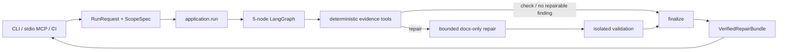

# 当前架构文档

本目录描述 Doc-Code Drift Maintenance Agent 的**当前实现架构**，并把早期
`docs/reference/` 中的技术探索映射到今天实际采用的方案。

## 文档边界

不同文档承担不同职责：

| 层级 | 作用 | 发生冲突时如何处理 |
| --- | --- | --- |
| `src/` 与 `tests/` | 当前可执行行为和验收事实 | 先以源码和测试还原真实行为 |
| `docs/spec/` 与主设计 | 规范、边界和阶段合同 | 用于判断实现是否偏离设计 |
| `docs/arch/` | 面向维护者的当前架构说明 | 随实现变化同步更新 |
| `docs/reference/` | 早期方案、调研和选型背景 | 不能作为当前架构依据 |

当前主设计是 [Doc-Code Drift Maintenance Agent 设计](../superpowers/specs/2026-07-12-doc-code-drift-agent-design.md)。
Stage 2、3、4 的增量合同分别位于 [docs/spec](../spec/)；本目录不复制完整验收条款，而是解释这些合同如何落在代码里。

## 阅读顺序

1. [系统架构](system-architecture.md)：运行时边界、组件关系、状态流、数据流和源码落点。
2. [技术选型与演进](technology-decisions.md)：当前技术栈，以及 reference 中方案的沿用、替换和延后。
3. [核心算法](algorithms.md)：scope、证据抽取、对齐、检测、修复、事务、验证、状态聚合和 benchmark 算法。

## 一页摘要

当前系统不是 Multi-Agent 平台，而是一个单一、有界的 Drift Maintenance Agent：

它的关键约束是：

- Git、Griffe、Python AST、Markdown parser 和 detector 负责可复验的定位与判断；
- 只对唯一 exact-FQN 对齐的证据自动处理，歧义不会交给模型猜测；
- 模型只出现在显式开启的窄语义修复中，不能选择文件、span、命令或 diff；
- 自动写入默认只面向 Markdown，Python 只允许 AST 已证明的 docstring 字符串范围；
- source hash、exact text、workspace lock、原子替换、回滚和最终 snapshot closure 共同保护写入；
- doctest/pytest 由受信配置提供，经过 allowlist 后在一次性仓库副本中以 `shell=False` 运行；
- SQLite 只保存可失效的运行记录、人工 decision 和 symbol alias，不覆盖当前证据；
- CLI、MCP、CI 都是薄 adapter，只调用一次统一的 application 边界；
- benchmark supervisor 属于独立评测平面，不会被普通 check/repair 隐式启动。

## 当前能力阶段

| 阶段 | 主要能力 | 状态 |
| --- | --- | --- |
| Stage 1 | 单 Agent 纵向闭环、基础 signature drift、CLI | 完成 |
| Stage 2 | 结构检测加固、docstring、事务、SQLite memory、离线结构评测 | 完成 |
| Stage 3 | executable oracle、窄语义检测/修复、模型预算与 OpenRouter adapter | 完成 |
| Stage 4 | committed-range scope、MCP、CI artifacts、对照评测与真实 benchmark harness | 完成 |

阶段状态描述的是当前仓库实现；历史 spec 的 frontmatter 若未及时更新，不应反向覆盖源码和验收事实。

## 更新规则

修改以下任一边界时，应同步更新本目录：

- graph 节点、路由或 retry 所在层；
- provider、detector、truth policy 或自动修复支持矩阵；
- public bundle / adapter contract；
- workspace、validation、模型或网络安全边界；
- memory identity、失效规则或 schema；
- benchmark 配对键、scorer、指标口径或 live authorization 边界。
