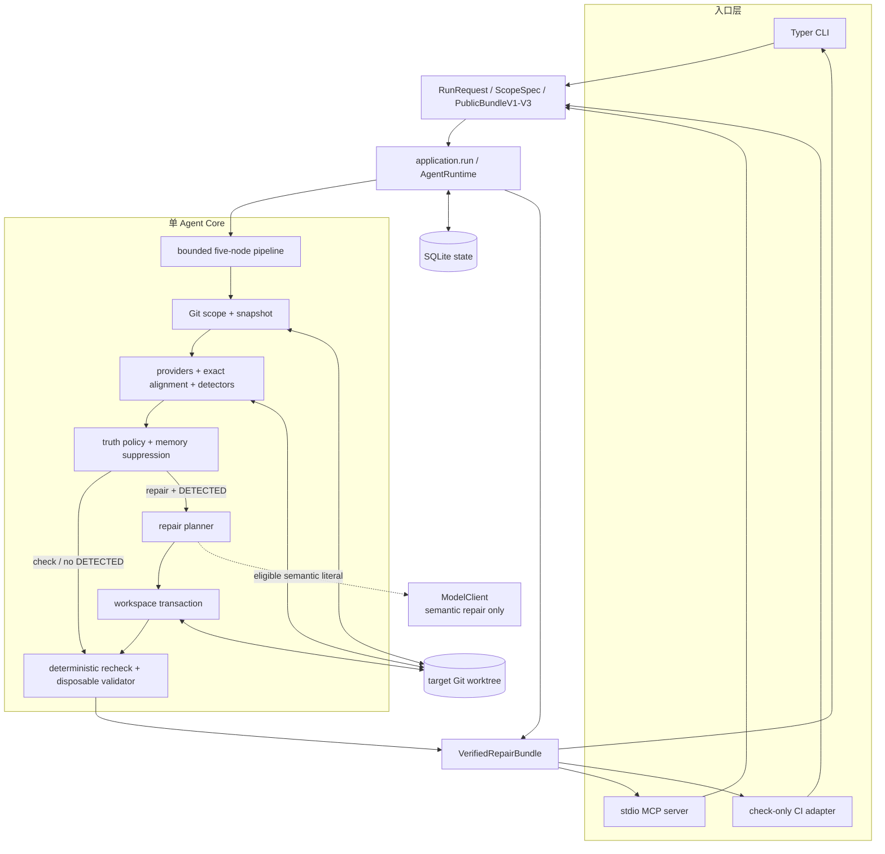
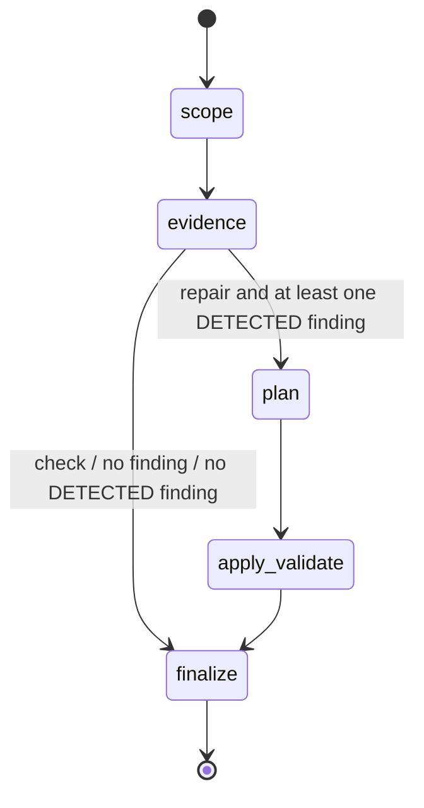
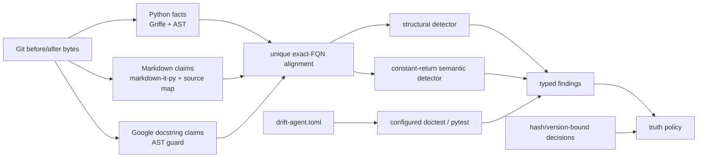
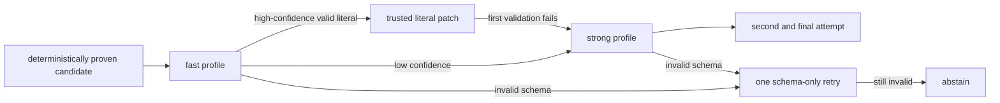

# 系统架构

## 1. 目标与边界

Doc-Code Drift Maintenance Agent 面向个人 Python 仓库，在代码变化后完成一条可审计的闭环：

1. 冻结本次 Git 范围和工作区快照；
2. 从代码与文档中提取结构化证据；
3. 只在唯一、确定的对齐上判断 drift；
4. 根据 truth policy 决定自动修、请求审批或 abstain；
5. 对允许的文档范围生成局部 patch；
6. 重检、运行 required validator，并在证据未过期时发布结果。

首版边界是 Python、Markdown 和受支持的 Google-style docstring。它不是通用知识库、持续运行 daemon、多语言文档平台或自动改业务代码的 Coding Agent。

## 2. 系统上下文

图中的 provider、detector、planner、validator、model client 和 storage 都是 Agent 调用的普通工具，不拥有独立目标、对话或控制循环。

## 3. 入口与唯一应用边界

三个生产入口共享 [application.py](../../src/drift_agent/application.py) 中的 `run` 边界：

| 入口 | 职责 | 额外限制 |
| --- | --- | --- |
| [CLI](../../src/drift_agent/cli.py) | 参数解析、人类/JSON 输出、管理 decision/alias、显式 model probe 和 benchmark 命令 | 默认 V1；语义能力需要显式 V3 与 opt-in |
| [MCP](../../src/drift_agent/adapters/mcp.py) | 将两个 typed tool 映射为 `RunRequest` | server-bound 单仓库、stdio-only、调用方不能改预算/凭据/命令 |
| [CI](../../src/drift_agent/adapters/ci.py) | committed-range check 和四个固定 artifact | check-only、必须 `--since`、state/artifacts 在 worktree 外、无上传/评论/Git 写入 |

公共 V3 contract 位于 [adapters/contracts.py](../../src/drift_agent/adapters/contracts.py)，rendering 位于 [adapters/rendering.py](../../src/drift_agent/adapters/rendering.py)。Adapter 不直接调用 detector、validator 或 store，也不实现自己的 retry；每次请求只进入 application 一次。

## 4. 当前状态图

当前 [agent/pipeline.py](../../src/drift_agent/agent/pipeline.py) 是五节点有界流程（原为 LangGraph `StateGraph`；它没有环、checkpointer 或 interrupt，现为等价的普通 Python，保留了逐 key 合并节点返回值的语义）：

这与早期设计稿中的概念流程略有不同：最多两次 patch attempt、fast→strong 升级、group-local rollback 等细节封装在 `apply_validate` 节点和相关 service 内，而不是流程上的开放回边。因此系统不会形成无限 ReAct 循环。

节点职责如下：

| 节点 | 输入/输出重点 | 失败原则 |
| --- | --- | --- |
| `scope` | config/hash、Git baseline/HEAD、changed paths、repo/workspace identity、初始 snapshot、run record | revision、路径、identity 或快照无法唯一证明时 fail closed |
| `evidence` | facts、claims、alignments、findings、truth disposition、validation manifest | 歧义/不支持形成稳定 unresolved，而非猜测 |
| `plan` | patch attempts、repair groups、冲突标记、可选语义 proposal | 只规划受信 anchor 上的局部替换 |
| `apply_validate` | 原子写入、重检、required validation、attempt/rollback receipt | 任一前置条件或 required validation 不满足就回滚/abstain |
| `finalize` | 最终 closure、status、usage、memory event、public bundle | 发布前证据变化返回 stale；异常返回 failed |

流程共享的 typed state 位于 [agent/state.py](../../src/drift_agent/agent/state.py)。领域对象和 bundle 位于 [domain/models.py](../../src/drift_agent/domain/models.py)，跨版本序列化集中在 [domain/serialization.py](../../src/drift_agent/domain/serialization.py)。

目前依赖组合根和五个 phase 的主要编排都集中在 [application.py](../../src/drift_agent/application.py) 的 `AgentRuntime` 中；`agent/pipeline.py` 只定义节点顺序与那一个条件分支。这是当前真实代码形态，不应把设计图中的逻辑分层误读成已经拆分完成的独立 service。

## 5. 证据平面

主要 provider：

- [python_facts.py](../../src/drift_agent/providers/python_facts.py)：public Python function/method、signature、source anchor 和窄常量返回事实；
- [markdown_claims.py](../../src/drift_agent/providers/markdown_claims.py)：exact-FQN 标题、signature fence、truth frontmatter 和 source span；
- [docstring_claims.py](../../src/drift_agent/providers/docstring_claims.py)：受支持的 Google-style `Args`/`Returns`，并保留 AST 可写范围；
- [semantic_claims.py](../../src/drift_agent/providers/semantic_claims.py)：受限的 ``Returns `<literal>`.`` / ``Always returns `<literal>`.``；
- [executable_examples.py](../../src/drift_agent/providers/executable_examples.py)：从受信配置编译定向 doctest/pytest oracle。

Detector 位于 [detectors](../../src/drift_agent/detectors/)。结构、executable 和 semantic detector 都不调用模型。通用散文、模糊 symbol 搜索、动态代码或无法唯一定位的声明不会被强行转成高置信 finding。

## 6. Truth policy 与权限

文档 claim 的 truth direction 来自文档 frontmatter 或 `drift-agent.toml` 中的路径规则：

| 分类 | 处理方式 |
| --- | --- |
| `code_derived` | 当前代码可以作为真值，finding 可进入自动 docs-only repair |
| `design` / `contract` | 文档可能高于实现，转为 `needs_approval`，不自动覆盖 |
| `unknown` / 多规则命中 | 转为 `unresolved`，要求人工澄清 |

因此“检测到不一致”不等于“代码一定正确”。Truth policy 是自动写权限的门，而不仅是报告标签。

## 7. 修复与验证平面

自动修复由四层约束组成：

1. [repair/signature.py](../../src/drift_agent/repair/signature.py)、[repair/patches.py](../../src/drift_agent/repair/patches.py) 或 [repair/semantic.py](../../src/drift_agent/repair/semantic.py) 只能从已证明的 evidence anchor 构造 replacement；
2. [repair/planner.py](../../src/drift_agent/repair/planner.py) 合并相同 replacement，并标记 span、base、replacement 或跨文件验证依赖冲突；
3. [workspace/transaction.py](../../src/drift_agent/workspace/transaction.py) 校验 repo-local 路径、target kind、source hash、exact text 和 span，无冲突后执行原子替换；
4. application 对每个 group 重检 finding，运行 required validation，最后再做全局 closure 和 snapshot check。

写入支持矩阵：

| 目标 | 自动写权限 |
| --- | --- |
| Markdown 的受信 claim/literal span | 支持 |
| Python function/method 的 AST-proven docstring 字符串 | 只支持受限结构修复 |
| Python 业务 AST、测试、配置、任意其他文件 | 不支持 |
| executable example 内容 | 当前只检测/验证，不自动改写 |

[validation/commands.py](../../src/drift_agent/validation/commands.py) 只接受受信配置中的 `python -m doctest`、`python -m pytest` 或 `pytest`，要求显式 repo-local target，拒绝 shell 控制字符、argfile、越界路径和非 allowlisted flag。它使用当前解释器、`shell=False`、一次性副本、最小环境、禁用 pytest plugin autoload，并默认安装进程内 socket guard。该隔离减少凭据和普通副作用，不宣称是抵御恶意代码的 OS/container sandbox。

## 8. 模型边界

模型只参与显式 `repair --semantic --output-version 3` 且已有唯一、code-derived、可修复 semantic finding 的情况：

`SemanticRepairProposal` 是 `extra=forbid` 的严格 Pydantic schema。模型只看到 finding kind、claim mode、documented value 和 required value，只能返回 decision、单个 literal replacement、confidence 和有界 rationale。路径、span、command、diff、Python 写入和 truth direction 都不由模型决定。

Provider-neutral contract 位于 [model/contracts.py](../../src/drift_agent/model/contracts.py) 和 [model/client.py](../../src/drift_agent/model/client.py)；[model/openrouter.py](../../src/drift_agent/model/openrouter.py) 是首个 transport adapter。普通 check、结构修复、未 opt-in 的 repair 和离线评测不会因环境变量存在而隐式联网。

## 9. 状态、并发与 Memory

[workspace/identity.py](../../src/drift_agent/workspace/identity.py) 建立两级 Git identity：

- `repository_id = SHA256("repo-v1\0" + real_git_common_dir + "\0" + root_commit)`；
- `workspace_id = SHA256("workspace-v1\0" + repository_id + "\0" + real_worktree_root)`。

同一 Git common repository 的 linked worktree 共享 repository memory，但各自拥有 workspace identity 和写锁。默认 SQLite 位于 Git administrative state；显式 `state_dir` 必须解析到 worktree 外。

[memory](../../src/drift_agent/memory/) 保存：

- run、group 和 validation 事件；
- 人工 decision；
- symbol alias 及其证据绑定。

Decision/alias 必须同时匹配 repository、finding fingerprint、evidence hash、detector version 等条件才能复用；历史状态不能覆盖当前 evidence。写入期间 [workspace/lock.py](../../src/drift_agent/workspace/lock.py) 使用 workspace 级 OS lock，snapshot generation 和 source hash 再负责检测锁外变化。

持久化事件还构成一个可校验的 lifecycle：check 固定经过 `run_started → snapshot_captured → facts_collected → findings_detected → decisions_applied → run_finished`；repair 在此前缀后增加 plan、lock、每个 group 的 started/retained/rolled_back/skipped、最终验证与可选 publication-aborted 事件。SQLite 在 finish 时检查事件序号连续、每个 group 只有一个 terminal、整次 run 只有一个终态。

## 10. 状态与退出码

[domain/status.py](../../src/drift_agent/domain/status.py) 统一 CLI、MCP、CI 所见的运行状态：

| 状态 | 含义 | 进程退出码 |
| --- | --- | --- |
| `clean` / `fixed` | 无 drift，或所有 finding 已验证修复 | `0` |
| `drift_found` / `partial` / `needs_approval` / `unresolved` | 有业务结果但需要处理 | `1` |
| `stale` / `failed` | 证据过期或基础设施/边界失败 | `2` |

`failed` 优先于 `stale`；repair 中全部 `fixed` 才是 `fixed`，fixed 与其他 disposition 混合为 `partial`。

## 11. 独立评测平面

[evaluation](../../src/drift_agent/evaluation/) 不参与普通 Agent 请求：

- `structural-v1` 与 `stage3-v1` 是冻结、离线、可重复的能力评测；
- Stage 4 comparison importer 只接收严格 observation，不启动任一 subject；
- benchmark harness 以 plan → isolated run → trusted score → report 运行 Codex/Agent 对照；
- 只有显式 `--authorize-live-codex` 才允许真实 Codex 调用；run 不自动 retry；
- hidden scorer 从仓库快照和 public result 计算指标，不采信 subject 自报 TP/FP/FN/PASS。

Benchmark 使用独立 runtime、artifact、auth 和 oracle 边界。它是实验 supervisor，不是生产 Agent 的“第二个 Agent”。

## 12. 源码目录地图

| 目录 | 责任 |
| --- | --- |
| `agent/` | state graph、run state、budget ledger |
| `scope/` | Git changed/since 范围与 snapshot |
| `providers/` | 从代码、Markdown、docstring、验证配置提取 evidence |
| `detectors/` | 确定性 drift 判断 |
| `repair/` | patch 生成、语义 proposal 边界、group/conflict planning |
| `workspace/` | identity、lock、原子 transaction 和 rollback |
| `validation/` | docstring AST guard、allowlisted executable validation |
| `memory/` | SQLite schema/store/service 与 evidence-bound memory |
| `model/` | provider-neutral structured model contract 和 OpenRouter adapter |
| `adapters/` | MCP、CI、public contracts、rendering |
| `evaluation/` | frozen eval、Stage 4 comparison、benchmark supervisor/scorer |
