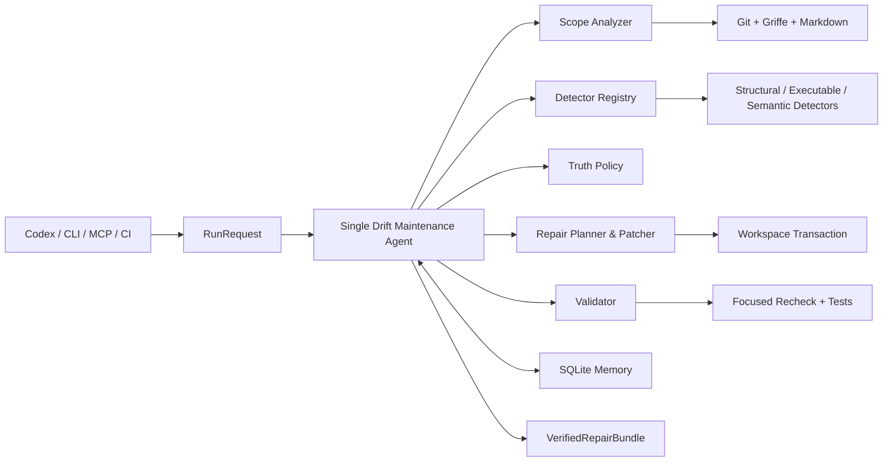

# Doc-Code Drift Maintenance Agent 设计

> 日期：2026-07-12
>
> 状态：核心设计已确认；阶段 1–3 已完成，阶段 4 实施中（2026-07-15）
>
> 适用范围：个人使用、Python 仓库、Markdown 与 docstring

## 1. 决策摘要

本项目不再设计成“多个专家 Agent 加 Supervisor 的文档扫描平台”，而是一个有边界的仓库级文档维护 Agent：

> 代码发生变化后，Agent 自动发现受影响的文档，判断 doc-code drift，修复以代码为真值的文档；候选修改在受控事务中验证，只有通过后才保留，并返回带证据、diff 和验证回执的 `VerifiedRepairBundle`。

已锁定的设计决策：

- 用户是个人开发者，主要与 Codex 等 Coding Agent 配合使用。
- 首版只支持 Python，不以多语言或大规模平台化为目标。
- 只有一个 Drift Maintenance Agent；解析器、检测器、测试器和存储都是工具或 provider。
- 默认可以自动修改文档；涉及业务代码时只能提出建议，必须由用户批准。
- CLI、stdio MCP 与 pre-push/CI adapter 复用同一个 Agent Core，区别只在传输协议和应用策略。
- 核心产物不是健康报告，而是经过验证的修复 patch。
- Git 与当前代码/文档是本次判断的原始证据；Memory 只保存可失效的经验和人工决策。
- 常见结构类 drift 走确定性路径，LLM 只处理已经对齐的语义问题。
- 不使用 Multi-Agent、GraphRAG、通用向量库、常驻文件监听或 Web UI。

## 2. 问题与核心假设

通用 Coding Agent 可以处理文档同步，但每次都需要重新搜索仓库、理解上下文、判断真值并组织验证，成本和时延都偏高。Doc-code drift 是一个搜索空间较窄、证据类型稳定、修复模式可复用的领域，适合做成专用 Agent。

本项目要验证的核心假设是：

> 在同一批 Python doc-code drift 任务上，专用 Agent 可以在修复质量不低于通用 Codex 基线的前提下，减少上下文、模型调用、工具调用和完成时间。

这是需要通过实验验证的目标，不预设具体提升比例。质量和无回归是硬约束，成本与时延是比较指标。

## 3. User Stories

### 3.1 Codex 开发后的自动维护

作为个人开发者，我希望 Codex 完成一批代码修改后调用 Drift Agent。Drift Agent 只读取本次变更影响的符号与文档，自动修正文档并验证，Codex 最终只需要向我展示修复摘要和 diff。

期望流程：

```text
Codex 完成代码修改
  -> 调用 CLI 或 MCP
  -> Drift Agent 发现、修复、验证
  -> 返回 VerifiedRepairBundle
  -> Codex 汇报结果并继续原任务
```

### 3.2 主动检查与修复

作为个人开发者，我希望对一个 Python 仓库的当前 dirty worktree 主动运行检查或修复：

```bash
uv run drift-agent check --repo /path/to/repo --format json
uv run drift-agent repair --repo /path/to/repo --format json
uv run drift-agent check --repo /path/to/repo --semantic --format json --output-version 3
uv run --env-file .env drift-agent repair --repo /path/to/repo --semantic --format json --output-version 3
```

默认 `scope` 是目标仓库相对 `HEAD` 的 staged、unstaged 与相关 untracked 变化；显式
`--since REV` 则以 `merge-base(REV, observed HEAD)` 为 before side，并覆盖此后的 committed
变化和当前 worktree。显式文件与显式 symbol scope 尚未实现；若后续加入，仍须经过相同的
影响分析和安全边界。验证通过的文档修复直接保留在工作区；无法安全修复的项明确返回
`unresolved` 或 `needs_approval`。

### 3.3 CI 兜底（Stage 4 已完成）

作为个人开发者，我希望 pre-push 或 CI 在 Coding Agent 忘记调用时运行只读检查。CI 不自动修改或提交代码，只生成机器可读结果和人类可读摘要，并在存在未解决 drift 时失败。

## 4. 非目标

首版明确不做：

- Java、JavaScript 等其他语言；
- 多仓库关联和组织级知识平台；
- Multi-Agent、Supervisor 或角色扮演式协作；
- 通用问答 RAG、GraphRAG 和向量数据库；
- 常驻 daemon、文件系统实时监听和编辑器 UI；
- 自动修改业务代码；
- 从零生成整套文档；
- 自动创建、提交或合并 PR；
- 把所有测试命令交给 LLM 自由决定；
- 以“覆盖 Agent JD 名词”为目的的组件。

## 5. 总体架构



架构只有一个会作决策和采取行动的 Agent。以下组件都不是 Agent：

- `Scope Analyzer`：将 Git diff 映射到受影响的 Python 符号和文档候选。
- `Detector Registry`：运行能够为当前候选提供证据的检测器。
- `Truth Policy`：根据文档类型和证据决定应该修改文档、建议修改代码或拒绝判断。
- `Repair Planner & Patcher`：优先选择确定性模板，必要时才调用 LLM 改写局部散文。
- `Validator`：重跑相关 detector，以及配置中显式声明、通过 allowlist 的 doctest/pytest。
- `Memory`：保存历史决策和修复经验，不能替代当前源码事实。
- `Adapters`：CLI、MCP 与 CI 共享 application service；MCP/CI 只投影公开 V3 bundle，不复制 core。

## 6. Agent 状态机

Agent 使用有界状态图，不使用开放式无限 ReAct：

```text
scope_change
  -> retrieve_relevant_memory
  -> gather_evidence
  -> classify_truth_direction
  -> plan_repair
  -> generate_patch
  -> validate_patch
       -> finish
       -> retry（最多 2 次）
       -> needs_approval
       -> abstain
```

Agent 的自主性体现在：

- 根据变更和当前证据选择需要运行的 detector；
- 综合多种证据并判断真值方向；
- 在模板修复和语义改写之间选择；
- 根据验证失败原因调整一次修复策略；
- 证据不足、预算耗尽或风险越界时主动停止。

状态图的边界：

- 单个 finding 最多产生两次 patch attempt。
- 每个运行都有模型调用、token、时长和测试命令预算。
- 任何自动落盘都必须经过验证。
- LLM 不得自行扩展扫描范围、执行任意 shell 命令或修改业务代码。

## 7. 触发时机与入口

### 7.1 主触发：Coding Agent 完成一批修改后

项目的 `AGENTS.md` 或 Coding Agent 配置约定：修改公开 API、默认值、行为、异常、配置或示例后，调用 drift maintenance 工具。按一批逻辑修改触发，不按每次保存文件触发。

### 7.2 主动触发

CLI 通过 `--repo` 指定仓库根目录；check/repair 共用同一个 application service。Stage 4
新增绑定单仓库的 stdio MCP，以及要求显式 revision 与外部 state/artifact 目录的 CI check。

当前范围语义固定为：

- `scope.kind=changed` 表示当前工作区相对 `HEAD` 的 staged、unstaged 和相关 untracked
  文件；它仍是默认值，CLI 不需要也不接受 `--changed`。
- `scope.kind=since` 由显式 `--since REV` 选择，以 `merge-base(REV, observed HEAD)` 为
  before side、当前 worktree 为 after side；`--file` 与 `--symbol` 仍未实现。
- `--state-dir` 可覆盖 SQLite state 目录，`--lock-timeout-seconds` 可调整 repair lock
  等待上限；两者都不扩张分析或写入范围。

### 7.3 兜底触发

pre-push 或 CI 使用同一个 `ci check` 模式。它不依赖 Coding Agent 是否记得调用，禁止写
工作区，并只在显式外部目录写 state 与 artifacts。

### 7.4 不采用的触发

首版不实现常驻文件监听。它容易与 Coding Agent 竞争写入工作区，并会引入防抖、并发、进程生命周期和噪声告警等非核心问题。

### 7.5 仓库配置与对齐规则

目标仓库通过根目录下的 `drift-agent.toml` 提供最小配置，首个 Click 纵切不能把路径或符号写死在 detector 中：

```toml
[project]
source_roots = ["src"]
docs_roots = ["docs"]
include = ["src/**/*.py", "docs/**/*.md"]
exclude = ["**/generated/**", "**/.venv/**"]

[truth]
code_derived = ["docs/api.md", "docs/api/**"]
design = ["docs/design/**"]
contract = ["docs/contracts/**"]

[validation]
commands = [
  "python -m doctest docs/api.md",
  "python -m pytest tests/test_api.py -q",
]
network = false
```

文档可用 frontmatter `drift_truth: code_derived | design | contract` 作显式标记；它比路径规则优先。

`Scope Analyzer` 先将 diff 行映射到变更前后的 Python symbol，再通过以下确定性顺序查找文档：

1. 配置或文档指令中的显式 symbol ID；
2. 文档代码 span、链接或引用中的 FQN；
3. 当前文档作用域内唯一的精确 symbol 名；
4. 人工确认并且 source hash 仍有效的 alias。

只有唯一且高置信的 alignment 可以进入自动修复。存在多个候选、仅有模糊语义相似或需要 LLM 猜测对应关系时，返回 `unresolved`。首版不使用 embedding 做符号对齐。

验证命令只能来自配置和内置 allowlist，不接受占位符，也不从模型、Markdown 或
docstring 生成命令。当前只接受 `python -m doctest`、`python -m pytest` 和 `pytest`，
并要求配置直接给出仓库内显式 target；命令解析为 argv 后以 `shell=False` 执行。

## 8. 输入与输出契约

### 8.1 `RunRequest`

```json
{
  "mode": "repair",
  "repo_path": "/repo",
  "scope": {"kind": "changed"},
  "apply_policy": "docs_only",
  "budgets": {
    "max_patch_attempts_per_finding": 2,
    "max_model_calls_per_run": 4,
    "max_input_tokens_per_run": 20000,
    "max_validation_commands_per_run": 8,
    "timeout_seconds": 120
  },
  "state_dir": null,
  "lock_timeout_seconds": 5.0,
  "semantic_analysis": false,
  "semantic_repair": true
}
```

`mode` 只有两种：

- `check`：只读，发现问题但不产生工作区副作用。
- `repair`：允许在策略范围内修改文档并验证。

`semantic_analysis` 只允许用于 `check`，`semantic_repair` 只允许用于 `repair`；两者默认
均为 `false`。CLI 的 `--semantic` 按 mode 映射到对应字段。JSON semantic run 还必须
显式选择 `--output-version 3`；wire version 是 CLI/serializer 选项，不属于
`RunRequest`。

### 8.2 `VerifiedRepairBundle`

```json
{
  "status": "fixed",
  "run_id": "run_...",
  "snapshot": {
    "head_revision": "abc123",
    "workspace_fingerprint": "sha256:...",
    "input_file_hashes": {
      "src/client.py": "sha256:...",
      "docs/client.md": "sha256:..."
    }
  },
  "scope": ["src/client.py"],
  "findings": [
    {
      "id": "finding_...",
      "type": "signature_drift",
      "disposition": "fixed",
      "truth_source": "code",
      "code_evidence": {
        "path": "src/client.py",
        "line": 42,
        "source_hash": "sha256:..."
      },
      "doc_evidence": {
        "path": "docs/client.md",
        "line": 18,
        "source_hash": "sha256:..."
      },
      "reason": "文档缺少 timeout 参数"
    }
  ],
  "changes": {
    "applied": true,
    "files": ["docs/client.md"],
    "patch": "unified diff"
  },
  "validation": [
    {
      "finding_ids": ["finding_..."],
      "attempt_id": "attempt_...",
      "check": "drift_redetect",
      "required": true,
      "status": "passed",
      "summary": "finding no longer detected",
      "duration_ms": 0
    },
    {
      "finding_ids": ["finding_..."],
      "attempt_id": "attempt_...",
      "check": "doctest",
      "required": true,
      "status": "passed",
      "summary": "doctest passed (exit 0)",
      "duration_ms": 37
    }
  ],
  "approval_required": [],
  "usage": {
    "model_calls": 0,
    "model_calls_by_profile": {},
    "tool_calls": 5,
    "validation_commands": 2,
    "input_tokens": 0,
    "output_tokens": 0,
    "estimated_cost_usd": 0.0,
    "duration_ms": 842
  }
}
```

当状态为 `needs_approval` 或 `partial` 时，`approval_required` 中的对象至少包含 `id`、`finding_id`、`kind`、`reason`、输入 file hashes、可选候选 diff 和建议验证项。调用方不能只凭自然语言摘要应用代码建议。

允许的终态：

| 状态 | 含义 | 工作区行为 |
|---|---|---|
| `clean` | 未发现 drift | 不修改 |
| `drift_found` | `check` 模式发现 drift | 不修改，返回 findings |
| `fixed` | 文档 patch 已验证 | `repair` 模式下落盘 |
| `partial` | 部分 finding 已修复，仍有审批项或未解决项 | 只保留逐项及最终整体验证均通过的文档 patch |
| `needs_approval` | 应考虑修改代码或契约 | 不修改代码，返回建议 |
| `unresolved` | 有 drift，但无法在预算内安全修复 | 撤销 Agent 自己的未验证修改 |
| `stale` | 分析后源文件又发生变化 | 不覆盖新内容 |
| `failed` | 工具、模型或环境失败 | 尽可能回滚 Agent 自己的修改；若 Agent 字节无法恢复，`changes.applied=true` 并返回残留文件、可重放 diff 和回滚验证证据 |

### 8.3 Adapter 映射

- CLI：默认输出简短摘要，`--format json` 输出完整 bundle。
- MCP：用独立 `PublicBundleV3` 返回同一 bundle 的 typed structured result。
- CI：保存 V3 JSON、SARIF 与 Markdown artifacts；这些格式不进入 Agent Core。

CLI 退出码固定为：

- `0`：`clean` 或全部 `fixed`；
- `1`：`drift_found`、`partial`、`needs_approval` 或 `unresolved`；
- `2`：`stale` 或 `failed`。

每个 finding 必须携带自己的 disposition。run-level `status` 按以下规则聚合：

- `check` 模式在没有 active finding、required validation 也没有 unavailable/budget
  incomplete 时为 `clean`；存在已确认 drift 时为 `drift_found`。required validation
  或 semantic alignment 不可用、或预算耗尽时可在没有 finding 的情况下返回
  `unresolved`。被人工 decision 抑制的 executable finding 若仍有 required FAILED
  receipt，run 继续保持 `drift_found`；
- `repair` 模式全部修复为 `fixed`，全部等待审批为 `needs_approval`，全部无法修复为 `unresolved`；
- 同时存在已修复项和未解决/审批项时为 `partial`；
- 无法确认最终工作区一致性时为 `stale`，运行结果整体不可信时为 `failed`。

patch attempt 上限按 finding 计算；模型调用、输入 token、验证命令和 wall-clock 上限按 run 计算。全局预算耗尽后，已经验证通过的 finding 可以保留，其余 finding 记为 `unresolved(reason=budget_exhausted)`，run-level 状态为 `partial` 或 `unresolved`。

建议命令：

```bash
uv run drift-agent check --repo /path/to/repo --format json
uv run drift-agent repair --repo /path/to/repo --format json
uv run drift-agent check --repo /path/to/repo --semantic --format json --output-version 3
```

Stage 4 MCP tools：

- `check_drift(scope)`
- `repair_drift(scope)`

## 9. 领域数据模型

| 类型 | 用途 | 关键字段 |
|---|---|---|
| `CodeFact` | 当前代码的结构化事实 | symbol ID、签名、默认值、受支持的常量返回行为证据、source hash、位置 |
| `DocClaim` | 文档声明 | claim 类型、目标符号、正文、byte anchor、exact text、source hash |
| `Alignment` | 声明与事实的对应关系 | doc claim、code fact、方法、置信度、证据 |
| `DriftFinding` | detector 发现的问题 | 类型、严重度、双锚点、真值方向、可修复性 |
| `RepairPlan` | Agent 的修复决策 | 目标文件、策略、预期验证、是否需要审批 |
| `PatchAttempt` | 一次候选修复 | finding IDs、unified diff、输入 hash、attempt 序号、生成方式 |
| `ValidationResult` | 修复后的证据 | finding/attempt ID、检查项、required、状态、摘要、耗时 |
| `DecisionRecord` | 可持久化的人工审批与 Agent 历史决策 | finding fingerprint、决定、来源、理由、有效 source hash |
| `ApprovalRequest` | 交给用户/Codex 的代码或契约审批项 | finding ID、证据、建议、可选候选 diff、所需验证 |
| `VerifiedRepairBundle` | 对调用方的统一产物 | 终态、findings、patch、验证、用量、审批项 |

所有 detector 和 adapter 只通过这些领域对象通信，避免用自然语言拼接隐藏协议。

## 10. Detector 与 Provider

Detector 负责提供证据，不拥有完整修复流程。统一接口表达为：

```python
class Detector(Protocol):
    id: str
    version: str

    def supports(self, context: DetectionContext) -> bool: ...
    def detect(self, context: DetectionContext) -> list[DriftFinding]: ...
    def validate(
        self,
        context: DetectionContext,
        attempt: PatchAttempt,
    ) -> list[ValidationResult]: ...
```

### 10.1 当前 detector

| 层 | 工具 | 覆盖范围 | LLM |
|---|---|---|---|
| Python facts | Griffe + Python AST | public function/method 的签名、参数、默认值，以及可证明的局部常量返回事实 | 否 |
| Markdown claims | markdown-it-py + Python AST | exact-FQN 标题、signature fence、精确 UTF-8 byte anchor 与窄 semantic sentence | 否 |
| Docstring claims | 内置 Google-style provider + AST guard | public function/method 的 `Args`/`Returns`；当前不检测 `Raises` | 否 |
| Executable examples | 内置 provider + doctest/pytest runner | 配置声明的单显式 target 示例/测试及 required validation receipt | 否 |
| Semantic drift | `ConstantReturnSemanticDetector` | 唯一对齐的 direct/always constant-return mismatch | 检测否；显式 repair 是 |

Stage 1～3 已依次完成结构、executable 与窄 semantic 路径。通用散文理解、全库语义
搜索和异常声明 drift 不属于当前实现。

`markdown-it-py` 只负责识别结构。额外的 `SourceMapper` 将 token 行范围映射回原始 UTF-8 字节区间，`DocClaim.anchor` 保存 `path + start/end byte + exact_text + source_hash`。对于阶段 1 签名 fence，可修复 anchor 只能覆盖 AST 精确函数语法区间，不能覆盖整个 fence body；周边空白必须逐字节保留，任何注释都保守地返回 `unresolved`。Patcher 只做带 expected-text/hash 前置条件的局部替换，不重新渲染整个 Markdown；无法唯一映射时返回 `unresolved`。所有 Python/Markdown 输入在读取前以及事务写入、提交、回滚前都必须按词法路径拒绝任一 symlink 组件，不能通过 canonicalization 跟随到另一证据身份。

### 10.2 CASCADE 与 DocPrism 的参考边界

- [CASCADE](https://github.com/TobiasKiecker/CASCADE) 是 Java/Javadoc/Maven 导向的研究原型，不进入 Python 首版依赖。保留其 pipeline、生成测试和执行验证思路作为设计参考。
- 截至 2026-07-12，[DocPrism](https://arxiv.org/abs/2511.00215) 的论文 artifact 不可公开访问，因此只保留其“先对齐、再判断”的研究思路，不假定或复制不可取得的源码。
- 当前实现不是通用 LCEF detector，而是确定性的 constant-return detector；它只接收
  已唯一对齐的 `DocClaim + CodeFact`。LLM 也只在显式 semantic repair 中接收同一份
  局部证据，不负责检测、全库搜索或选择 symbol。

后续 detector 必须通过统一协议接入，不能要求 Agent Core 理解某个工具的私有输出。

## 11. 真值方向与修复权限

Agent 在生成 patch 前必须先判断文档类型：

分类优先级为：显式 frontmatter/配置 > 路径规则 > 确定性 claim 类型 > `unknown`。规则冲突、没有显式策略的设计性散文、或分类置信不足时一律降级为 `unknown`，不能用 LLM 的单次分类结果开启自动写权限。

| 文档类型 | 例子 | 默认真值 | 自动行为 |
|---|---|---|---|
| `code_derived` | API 列表、参数说明、签名、默认值 | 当前代码 | 可以自动修文档 |
| `executable_example` | doctest、教程代码和预期输出 | 可执行结果 + 当前 API | 当前只检测/验证；不自动改写示例 |
| `design` | 设计意图、需求说明 | 不确定 | 返回 `needs_approval` |
| `contract` | API 规约、兼容承诺 | 契约或人工决定 | 返回 `needs_approval` |
| `unknown` | 无法分类的散文 | 不确定 | `unresolved`，不自动修改 |

硬性规则：

- `docs_only` 允许修改 Markdown，以及 `.py` 文件中被 Python AST 明确认定为 module/class/function docstring 的字符串字面量。
- 修改 docstring 后，去除 docstring 节点的前后 AST 必须完全一致；任何可执行 AST 变化都使 patch 验证失败并回滚。
- Agent 永远不自动修改 import、声明、表达式、控制流等可执行 Python 业务代码。
- 如果证据表明代码可能违反设计或契约，Agent 可以生成修复建议或候选代码 diff，但 `changes.applied` 必须为 `false`。
- 证据不足时不通过“选择代码为真值”来强行完成任务。

`needs_approval` 是结构化外部 handoff：Agent 在 `approval_required` 中返回 `ApprovalRequest`，由用户决定是否让 Codex 或其他 Coding Agent 修改代码。当前 Drift Agent 即使收到批准也不负责应用业务代码；代码修改完成后重新运行 drift check 即可闭环。

## 12. 修复策略

修复按成本从低到高路由：

1. **确定性 patch**：参数表、签名、默认值、符号名和 docstring 字段使用结构化编辑器更新。
2. **受约束的局部 LLM patch**：只向模型提供一个已对齐声明、相关代码事实、原段落和编辑约束。
3. **强模型升级**：只有小模型低置信或第一次语义修复验证失败时才允许。
4. **拒绝修复**：超过两次 attempt、证据不足、冲突或预算耗尽时停止。

LLM 不接收整个仓库，不负责寻找目标文件，也不直接写工作区。它只能返回符合 schema 的局部替换建议，由 patcher 检查目标 span 和 hash 后应用。

## 13. 验证与工作区事务

### 13.1 验证顺序

每个 `RepairPlan` 先生成一份 validation plan。所有候选 patch 都必须通过三项内部检查：

1. patch 能应用到预期 source hash，且变更范围符合 RepairPlan；
2. 原 finding 重检后消失，并且受影响范围没有新增同级或更严重 finding；
3. 最终 patch 仍能应用到运行开始时记录的 workspace snapshot。

以下检查按修复类型条件启用：

- 修改 docstring：必须通过“去除 docstring 后 AST 完全一致”检查；
- 任一已保留 repair group：必须运行配置中全部 required doctest/pytest，并在最终快照重跑；
- 当前不接受文档 build/lint 或其他 runner；扩展 allowlist 属于未来能力；
- 没有匹配规则的检查标记为 `skipped(not_applicable)`，不伪造执行结果。

`ValidationResult.status` 为 `passed | failed | skipped | unavailable`，并携带 `required`。`fixed` 要求全部内部检查和所有 required 检查均为 `passed`；optional 检查可以 `skipped`。required 检查环境不可用时，该 finding 变为 `unresolved(reason=validation_unavailable)`；validator 自身崩溃或结果不可解析才是 run-level `failed`。

当前使用配置驱动的定向验证，不默认执行全仓测试。验证命令来自仓库配置并通过固定
allowlist，不能由文档内容或 LLM 任意生成。

### 13.2 工作区安全

- 运行开始时记录输入文件 hash 和 Agent 可能修改的文档快照。
- `repair` 运行持有仓库级锁，避免两个 Drift Agent 并发写入。
- 每次写入前检查 source hash；发生外部修改时返回 `stale`。
- 验证失败时，只撤销 Agent 自己写入且 hash 仍匹配的内容，不覆盖调用方的新修改。
- `check` 模式不修改目标仓库的源码和文档。运行记录写入 Git common state DB 或显式 `--state-dir`；Stage 4 的 CI artifact 将写入 CI 临时目录。
- validator 在 disposable repository copy 中运行；副本排除 `.git`、所有名称以 `.env` 开头的文件/目录（`.env*`）、
  已知 cache 和 symlink。HOME、cache、bytecode 与 temp 重定向到同一次性环境；无法
  隔离的命令不得用于 `check`。
- 可执行业务 AST 始终只读；只有满足 docstring AST guard 的字符串字面量属于文档写权限。

文档 patch 仍通过调用方工作区中的 `WorkspaceTransaction` 执行；配置的 doctest/pytest
不在源工作区运行，而是在不含 `.git`、所有名称以 `.env` 开头的文件/目录（`.env*`）、
已知 cache 和 symlink 的 disposable repository copy 中以当前 Python、`shell=False` 和
最小环境执行。该副本是
正常项目测试的污染/凭证边界，不是针对恶意代码的 OS/container sandbox。

## 14. Memory

Memory 分两类，但都服务于文档维护任务，不做通用聊天记忆。

### 14.1 单次运行状态

LangGraph state 保存：

- scope 和输入快照；
- 已调用 detector；
- evidence、finding 和真值判断；
- repair plan 与 patch attempts；
- validation results；
- 剩余预算与终止原因。

### 14.2 仓库经验

完整形态可以保存：

- `runs`：运行终态、用量和耗时；
- `decisions`：人工确认、误报抑制和审批结果；
- `repair_attempts`：历史策略及成功/失败原因；
- `symbol_aliases`：文档别名、标准符号和重命名关系；
- `blind_spots`：动态行为等已知不可判定区域；
- `bad_cases`：漏检、误报和回归评测样本。

但不一次实现全部表。阶段 1 只记录 `runs`；阶段 2 增加人工 `decisions` 和必要的 `symbol_aliases`。repair attempt 先作为 run event，bad case 先保存为版本化 eval fixture；只有真实查询或评测证明需要时，才拆出 `repair_attempts`、`blind_spots` 和 `bad_cases` repository。

持久记录至少绑定：

```text
repo_id + code_source_hash + doc_source_hash + symbol_id + detector_id/version
```

失效规则：

- 代码或文档 source hash 改变后，旧结论不能直接抑制新 finding。
- detector 版本改变后，依赖其判断的 decision 需要重检。
- 只有人工确认的 ignore/false-positive 决策可以抑制重复告警；Agent 自己的历史结论只能用于排序和策略选择。
- Memory 只能影响优先级、对齐候选和修复策略，不能覆盖当前 detector 证据。
- 不引入 embedding 或向量检索；精确 ID、hash 和 SQLite 索引足够支持个人仓库。

## 15. 成本与时延策略

成本和速度来自领域约束，而不是单纯换小模型：

- Git diff 驱动，只分析受影响符号和文档。
- 结构、docstring 和可执行示例路径不调用 LLM。
- 每次语义调用只发送一个已唯一对齐 finding 的局部 claim/fact，不发送全库上下文。
- 默认使用可配置的 fast/cheap 模型 profile，只有明确条件才升级 strong profile。
- 相同 source hash、detector version 和配置下复用确定性结果。
- patch attempt 最多两次，模型和测试都有预算。
- 定向重检与测试优先于全仓验证。

所有运行在 bundle 中记录模型调用次数、token、耗时和工具调用，供后续基准比较。

## 16. 技术栈

| 领域 | 选择 | 说明 |
|---|---|---|
| 语言 | Python 3.11+ | 只服务 Python 仓库，不提前抽象多语言运行时 |
| Agent 编排 | LangGraph StateGraph | 表达有界状态、checkpoint、分支、重试和终态，不做 Multi-Agent |
| Schema | Pydantic | 领域对象、模型结构化输出和 adapter 契约 |
| Python facts | Griffe + Python AST | public API 签名、确定性 symbol identity 与窄常量返回事实 |
| Markdown | markdown-it-py | token/span 提取和局部 patch 锚点 |
| Docstring | 内置 Google-style provider + AST guard | `Args`/`Returns` 提取、局部修复与业务 AST 不变证明 |
| 可执行检查 | doctest、pytest | 只运行配置中显式 target 且通过 allowlist 的命令 |
| Git scope | git CLI | diff、revision、rename 和工作区状态 |
| 持久化 | SQLite（标准库或薄 repository 层） | 先做 run、人工 decision 和 alias，其他记录按数据需求增加 |
| CLI | Typer | 人类输出与 JSON 输出共用 application service |
| MCP | Python MCP SDK v1.x | stdio-only `check_drift`、`repair_drift` 薄 adapter |
| LLM | 内部 `ModelClient` protocol | fast/strong profile 可配置，不绑定单一厂商 |
| 测试与质量 | pytest、ruff、mypy | 单元、fixture、历史回放和契约测试 |
| Tracing | 结构化 run events + SQLite/JSONL | 首版不依赖外部观测平台 |

不使用 Chroma、Qdrant、tree-sitter、Redis、PostgreSQL 或消息队列。只有真实需求出现后才增加。

## 17. 建议代码边界

```text
src/drift_agent/
  domain/              # Pydantic contracts 与枚举
  agent/               # graph、state、routing 与 budget
  scope/               # Git diff、impact 与 symbol mapping
  detectors/           # structural.py、executable.py、semantic.py
  providers/           # Python/Markdown/docstring/executable/semantic evidence
  model/               # provider-neutral client、budget facade、OpenRouter 与 probe
  repair/              # plan、deterministic patch、LLM patch
  validation/          # re-detect 与 allowlisted doctest/pytest
  memory/              # SQLite repositories 与 invalidation
  workspace/           # lock、hash guard、apply、rollback
  evaluation/          # structural-v1、stage3-v1 与 Stage 4 offline comparison
  adapters/            # Public V3、stdio MCP、CI artifacts 与渲染
  cli.py               # CLI 与 check-only CI command
  application.py       # check/repair 的唯一 application service
tests/
  unit/
  integration/
  fixtures/
evals/
  datasets/
  runners/
  reports/
```

`application.py` 是所有入口共用的边界。adapter 不允许直接调用 detector 或写数据库。

## 18. 错误处理与安全边界

| 场景 | 行为 |
|---|---|
| 符号无法可靠对齐 | 返回 `unresolved`，不调用模型猜测全库位置 |
| 文档属于 design/contract | 返回 `needs_approval`，不修改代码 |
| LLM 输出 schema 错误 | 允许一次格式修复，不计作 patch attempt；仍失败则终止 |
| patch 无法应用 | 重新检查 hash；内容已变化则返回 `stale` |
| 验证失败 | 根据失败证据最多重试一次；最终失败则回滚 Agent 修改 |
| required 检查环境缺失 | 对应 finding 为 `unresolved(validation_unavailable)`，不伪装成通过 |
| 模型或工具超时 | 当前 finding 记为 `unresolved`；已有独立验证结果时为 `partial`，运行结果整体不可信才为 `failed` |
| 文档包含工具指令 | 作为不可信数据处理；不得改变系统策略或命令 allowlist |
| Memory 与当前证据冲突 | 当前文件和 detector 证据优先，旧 memory 失效 |

Agent 必须能够明确 abstain。自动化的目标不是“每次都给答案”，而是“能安全自动修的就修，不能修的准确停手”。

## 19. 评测

### 19.1 数据集

- Click：首个开发靶子和端到端演示。
- HTTPX：API 重命名和签名 drift 历史样本。
- Pydantic：docstring、签名和类型相关样本。
- Rich：删除符号后文档残留等高精度样本。
- Typer：CLI 教程、命令和输出样本。

数据由两部分组成：人工注入的可控 drift，以及从真实 Git 历史提取的出现/修复区间。

### 19.2 指标

检测指标：

- precision、recall、F1；
- `unknown`/abstention correctness；
- 按 structural、executable、semantic 分层结果。

修复指标：

- `repair_success@1` 和最多两次后的成功率；
- validation pass rate；
- regression-free patch rate；
- 错误修改业务代码次数，目标必须为 0；
- stale/conflict 情况下错误覆盖次数，目标必须为 0。

效率指标：

- 每个成功修复的模型调用、token 和估算成本；
- p50/p95 wall-clock time；
- 工具调用次数；
- 进入 strong model profile 的比例。

Memory 指标：

- 误报抑制 precision；
- 过期 memory 错误复用次数，目标必须为 0；
- alias/历史决策对对齐和修复成功率的增益。

### 19.3 基线

- detector-only：只报告，不修复。
- 通用 Codex：给予相同仓库快照、变更范围和任务目标。
- 专用 Agent：本设计的有界工作流。

比较重点是质量、成本与时延的联合结果，不把“更便宜”建立在漏检或错误修复上。

## 20. 分阶段落地

### 阶段 1：第一个完整纵切（已完成）

目标：证明项目从第一版就是 Agent，而不是扫描器。

- 建立领域 contracts 和 `VerifiedRepairBundle`。
- 实现配置驱动的 Git changed scope、symbol mapping 和 Markdown anchor。
- 用 Griffe 提取一个 Click public symbol。
- 从 Markdown 对齐一处参数/签名声明。
- 发现一个真实或注入的结构 drift。
- 生成确定性文档 patch。
- 实现最小 workspace snapshot、source hash guard、apply/rollback 和 `stale`。
- 重检并运行 validation plan 中的 required 检查。
- 通过 CLI 返回 `fixed` bundle，并记录 run state。

### 阶段 2：结构路径做精（已完成，2026-07-15）

- 扩展符号、参数、默认值、docstring 和删除符号 detector。
- 加固并发 workspace lock 和多 finding 的部分成功事务。
- 加入 SQLite 人工 decision 和必要 alias；repair/bad case 先沿用 run event 与 eval fixture。
- 建立 Click + HTTPX + Pydantic + Rich 结构评测集。

完成证据：`main` 中的 `7d188bf` 与 `0cc9674`；本地验证为 232 项 pytest、Ruff、strict mypy 全部通过，`structural-v1` 8/8 离线案例通过且模型/网络调用均为 0。

### 阶段 3：可执行与语义路径（已完成，2026-07-15）

- 接入 doctest/pytest 示例验证。
- 实现确定性的 constant-return semantic detector，以及只处理同一唯一对齐证据的模型辅助 semantic repair。
- 加入 fast/strong model routing、预算和最多两次 repair attempt。
- 评测自动修复、正确拒绝和回归。

完成进度（2026-07-15）：executable validation/check detection、确定性 constant-return semantic detection、provider-neutral/OpenRouter model boundary、application semantic repair 与离线 evaluation 五个纵切均已完成。实现包含 run budget、安全启动的 allowlisted doctest/pytest、disposable repository copy、完整 validation-input manifest、check-mode `broken_example`、mode-specific V3 semantic capability、严格 claim/fact grammar、唯一对齐、truth/Memory/snapshot 集成、strict `SemanticRepairProposal`、fast→strong 受控升级、全 finding 一次 schema-only retry、每 finding 最多两次 patch attempt，以及 workspace transaction 内的重检、required command、最终 closure、snapshot guard 和失败回滚。结构、docstring、executable、只读 semantic detection 与未 opt-in 的 repair 仍保持零模型调用；只有显式 `repair --semantic --output-version 3` 的唯一 code-derived semantic finding 可以进入模型路径。

完成证据：最新全量 pytest、Ruff 与 strict mypy quality gate 已通过，`structural-v1` 8/8 保持通过；冻结的 `stage3-v1` 10/10 通过，其中 7 个 executable case 模型调用为 0，3 个 semantic opportunity 的 `repair_success@1=1/3`、`repair_success@2=2/3`、abstention correctness `1/1`，fast/strong route ratio 为 `3/5` 与 `2/5`。评测合计 5 model calls、35 input tokens、15 output tokens、5 validation commands 与 50,000 nano-USD known cost，offline 与 model-script compliance 均通过。

### 阶段 4：入口与对照实验（已完成，2026-07-16）

- 已增加 `--since REV` committed-range scope；`--file` 与 `--symbol` 明确 defer。
- 已增加 server-bound、stdio-only MCP 薄 adapter。
- 已增加 check-only CI artifacts、SARIF/Markdown 渲染与 pre-push/GitHub Actions 示例。
- 已建立无隐式 live path 的离线 Codex/专用 Agent observation import 和确定性报告边界。
- 已实现复用现有数据集的 Codex benchmark harness：12 个 repo-observable structural/executable paired cases + 6 个专用 Agent controls；plan → isolated run → trusted score → report 全链路已落地。
- 真实 Codex 路径已经过逐次显式授权的运行验证；后续每次 live run 仍须单独授权，本文不授予持续授权。未测量项不得补零或预填胜负。

完成证据：`main` 中的 `9cfff28`；全量 730 项 pytest、Ruff 与 strict mypy 均通过。

## 21. 首个版本验收标准

第一阶段完成的最低条件：

- 一个 Click fixture 能从代码变更触发文档 drift。
- Agent 能自动定位、修复并验证至少一种结构 drift。
- 结构路径模型调用次数为 0。
- 成功结果包含双锚点证据、unified diff 和验证回执。
- 验证失败不留下 Agent 的未验证文档修改。
- 若 I/O 故障导致回滚无法恢复 Agent-owned bytes，结果必须为 `failed`，并在
  `changes` 与 validation evidence 中如实报告残留修改，不能声称已恢复。
- Markdown 修复不能修改任何 Python 文件；docstring 修复必须证明可执行 AST 完全不变。
- source hash 冲突时不覆盖新内容。
- CLI human/JSON 输出表达同一个 bundle。
- 自动化测试覆盖 `clean`、`drift_found`、`fixed`、`partial`、`needs_approval`、`unresolved`、`stale` 和 `failed` 的聚合规则。

成本与时延先记录基线，不在第一阶段设置未经实验支持的具体提升比例。

## 22. 设计原则

1. **Patch 是产品，报告是解释。**
2. **证据先于模型判断。**
3. **能确定性完成的路径不调用 LLM。**
4. **默认修文档，代码修改必须审批。**
5. **所有自动修改必须经过验证。**
6. **当前文件是原始证据，Memory 不是事实源。**
7. **一个 Agent 足够，工具不包装成 Agent。**
8. **从第一个纵切就闭环，不先堆平台基础设施。**

## 23. 参考资料状态

旧方案、调研记录和靶子选型已移动到 `docs/reference/`。它们保留事实材料和决策过程，但其中的 Multi-Agent、RAG、多语言、旧路线图和“只检测不修复”等内容均不再代表当前架构。

当前设计文档是后续实现计划的唯一架构真相源。
