# Stage 4 Codex Benchmark 运行设计

**Status**: Implemented
**Created**: 2026-07-15
**Live execution authorization**: Required per run; this document grants none
**Datasets**: `structural-v1`、`stage3-v1`

## 1. 决策摘要

首轮真实对照命名为 **frozen-case conformance comparison**，而不是“证明 Drift Agent 优于 Codex”。它只复用仓库中已经冻结的案例，不新增或改写 fixture/oracle。

- 主对照集固定为 12 个 repo-observable case：`structural-v1` 全部 8 个，以及 4 个真实 doctest/pytest case。
- 其余 6 个 case 继续作为 Drift Agent control regression：5 个依赖专用 Agent 私有的 timeout、budget 或 validation-failure 注入；`semantic.fast-success.v1` 则注入 frozen golden model answer。它们都不进入 Codex/Drift Agent paired aggregate。
- 第一次授权运行只做 `12 cases × 1 trial`，即最多 12 次 Codex live invocation；管线验收后才允许显式选择 `3 trials`，即 36 次 invocation。
- 每个 trial 的两个 subject 使用不同的临时 Git 仓库，但由同一份已审计 prepared snapshot 派生；只有 pair key 完全一致的 observation 才进入报告。
- Codex 只通过受控的 `codex exec` 子进程运行。默认测试使用 fake executable，不允许调用真实模型或网络。
- trusted scorer 根据隐藏 manifest、运行前后仓库字节和独立 validation 计算结果。Codex 不自报 TP/FP/FN、PASS、成本或安全结论。
- 当前 18 例足够验证管线并得到方向性结果，但不足以支持统计显著或跨项目泛化结论。

本设计只授权形成协议和实现计划，不授权本次会话启动 Codex、OpenRouter 或其他付费模型。

## 2. 为什么不是 18 个都直接对照

### 2.1 Portable paired suite：12 cases

| Layer | Cases | 首轮用途 |
| --- | --- | --- |
| structural | `structural-v1` 全部 8 个 | finding、exact patch、安全/保守拒绝合同 |
| executable | `executable.doctest-pass.v1`、`executable.doctest-fail.v1`、`executable.pytest-pass.v1`、`executable.pytest-fail.v1` | check-only finding 与 configured validation 识别 |

操作模式直接继承 frozen manifest，不由 benchmark 临时选择：8 个 structural case 全部执行 `repair`，4 个 executable case 全部执行 `check`。两个 subject 必须收到同一个 canonical `BenchmarkTaskV1.operation`；scorer 还会从 effective-request receipt 重算 Drift argv/Codex prompt，确认 adapter 实际执行的 operation 与 task 一致。仅有相同 `task_digest` 不足以掩盖 adapter 映射错误。

Structural 中的 historical/conservative cases 衡量的是当前冻结安全合同，不等价于“任何不同 patch 都错误”。当前 V1 reporter 只能按 structural/executable/semantic 分层，不能拆出 conservative-policy stratum；因此首版 structural aggregate 必须标为 `frozen-policy-conformance-only`，coverage sidecar 按 case 展示 policy tag，但不得把该 aggregate 当成通用 repair-quality headline。要独立聚合 detection、exact-repair 与 policy conformance，必须先扩展 schema/report。

### 2.2 Control regression：6 cases

| Case | 为什么不能直接公平配对 |
| --- | --- |
| `semantic.fast-success.v1` | Drift 侧 scripted transport 直接返回 frozen golden replacement；可验证 pipeline conformance，但不能与真实 Codex quality/cost 公平汇总 |
| `executable.timeout.v1` | timeout 由 Stage 3 runner 的模拟 process runner 注入，仓库本身不会产生同一刺激 |
| `executable.unavailable.v1` | 结果依赖 Drift Agent validation command allowlist，而不是仅依赖 repo bytes |
| `executable.budget-exhaustion.v1` | `max_validation_commands=0` 由 `RunBudgets` 在 Agent 内部执行 |
| `semantic.strong-success.v1` | runner 人工注入第一次 semantic validation failure |
| `semantic.two-failures-abstain.v1` | runner 人工注入两次 semantic validation failure |

这 6 个 case 仍在同一 batch 中各运行一次 Drift Agent offline control，并进入独立 control report，不随 paired `trials` 重复。若为了探索也运行 Codex，其结果只能进入 coverage/探索 sidecar，不得进入现有 comparison importer。`semantic.fast-success.v1` 只有在 Drift 侧也使用显式授权的真实模型时才可升入 portable suite；其余 5 个必须先提供 subject-neutral fault injector，并证明两个 subject 收到相同刺激。

### 2.3 Control 结果合同

每个 control 产生严格 `ControlResultV1`，而不是 `ComparisonObservationV1`：

```text
schema_version = 1
plan_digest + dataset_id=stage3-v1 + case_id + manifest_sha256
run_id = control-1
runner-contract digest + evidence_sha256
evaluation = canonical Stage3CaseEvaluation
```

Trusted wrapper 先重跑 manifest/hash audit，再用现有 Stage 3 scorer 生成 `Stage3CaseEvaluation`；`passed` 完全沿用其中的 status/finding/changed-bytes/accounting/offline/model-script compliance conjunction，不另造一套宽松公式。`ControlReportV1` 固定包含同一 plan 的 6 个 result，按 `case_id` 排序，并汇总 `planned/scored/passed/failed`、`controls_complete=(scored==6)` 与 `control_all_passed=(passed==6)`。JSON 使用 canonical serialization；Markdown 只渲染固定 summary 与 case/expected status/actual status/pass 表。Control failure 必须可见，但不得改变 paired quality 分母。

## 3. 总体架构

```mermaid
flowchart LR
    A["Frozen catalogs + manifests"] --> B["Offline plan and catalog audit"]
    B --> C["Subject-neutral prepared snapshot"]
    C --> D["Fresh repo: Drift Agent"]
    C --> E["Fresh repo: Codex"]
    D --> F["RawRunEvidenceV1"]
    E --> G["RawRunEvidenceV1"]
    F --> H["Trusted neutral scorer"]
    G --> H
    H --> I{"Plan class"}
    I -->|portable| J["ComparisonObservationV1"]
    J --> K["Plan-aware gate + existing offline importer"]
    K --> L["comparison-report.json + .md"]
    I -->|control| M["Control result"]
    M --> N["control-report.json + .md"]
    L --> O["plan-aware benchmark-report headline"]
    N --> O
```



实现拆成六个边界：

1. plan/audit：离线选择 case、trial、模型和预算，审计所有冻结 hash；
2. common case preparer：构造 subject-neutral Git 输入；
3. subject adapters：portable paired suite 分别调用 pinned Drift Agent CLI 与 `codex exec`；6 个私有 fault-injection controls 才调用现有 offline dataset runner；
4. evidence collector：采集有界、脱敏、可哈希的原始证据；
5. neutral scorer：隐藏 oracle 下独立计分；
6. offline reporter：复用现有 Stage 4 observation import/report。

Live adapter 不得直接进入现有离线 `build_stage4_comparison()`。只有 evidence 已完成、scorer 已独立产生严格 observation，并通过 plan-aware gate 后，才能调用现有 importer。该 gate 对 control case id fail closed，control 永远走独立报告分支。

## 4. 命令面与授权

建议实现以下显式命令，不把 live path 挂到普通 `check`、`repair`、MCP 或 CI：

```text
drift-agent benchmark plan
drift-agent benchmark run
drift-agent benchmark score
drift-agent benchmark report
```

### 4.1 `benchmark plan`

完全离线，默认行为：

- 审计两个 catalog 和全部 manifest/fixture hash；
- 选择 `portable-v1` 的 12 个 case，并列出 6 个单次 control slots；
- 默认 `trials=1`；
- 要求显式 `--codex-model MODEL`，不采用会漂移的默认模型；
- 解析并记录 Codex CLI version 与 binary SHA-256；
- 输出确定性的 `benchmark-plan.json`、预计 Codex invocation 数、单次 hard timeout，以及 CLI 无法硬限制 token/cost 的警告；
- 不检查或消费 API key，不调用 Codex。

### 4.2 `benchmark run`

真实执行必须同时满足：

```text
--plan /absolute/path/benchmark-plan.json
--artifacts-dir /absolute/external/path
--authorize-live-codex
```

还必须通过以下 preflight：

- plan digest、catalog/manifest/fixture hash 未改变；
- artifacts/state/runtime 均位于 dataset worktree 外，且无 symlink component；
- Codex binary version、binary digest、model、reasoning effort 与 plan 一致；
- 精确打印 live invocation 上限、单次 timeout、auth 方式、raw evidence 保留位置；
- 用户授权记录写入独立 `authorization.json`，不写进 deterministic plan；
- 没有 token/model-call/cost hard cap 时明确提示，不能声称预算已被强制。

不允许自动重试。provider/rate-limit 等瞬时失败如需重跑，必须由用户生成包含新 `trial_id` 的新 plan。新 plan 是完全独立的 batch，既不能与旧 plan 混入同一 comparison report，也不能替代旧 batch 的 incomplete/failure headline；只重跑失败 slot 只能标为 diagnostic retry。若要形成新的 authoritative smoke/full result，必须在新 plan 中重新安排完整 12-pair suite 与 6 controls。未来若需要跨 batch 展示，只能做 append-only lineage/meta-report，并同时保留每个 batch 的原始结论，不能选择性丢弃失败。

### 4.3 `benchmark score/report`

这两个命令完全离线。它们可以在 live auth 不可用的机器上重放 evidence、重新计分并生成报告。`benchmark report` 必须同时接收 plan 与 batch ledger；在进入现有 importer 前，逐条验证 observation 对应的 evidence、scorer、projection、output schema 全部绑定同一个 `plan_digest`。任何 mixed-plan 输入都整体 fail closed，不能仅凭现有 pair key 配对。原始证据改变会导致 `evidence_sha256` 改变；normalized observation/report 对相同输入必须 byte-identical。

## 5. `BenchmarkPlanV1`

Plan 至少冻结：

```text
schema_version
suite_id = portable-v1
dataset catalog hashes
selected case ids + manifest hashes
control case ids + manifest hashes
trial ids
explicit shuffle seed
subject-neutral task protocol version
neutral oracle/scorer version
subject-visible neutral-encoding digest
neutral projection-table digest
Codex output-schema digest
raw-evidence/control/headline schema-bundle digest
Codex prompt-renderer digest
Codex CLI version + binary sha256
Drift Agent version + production-slim wheel sha256 + runtime-lock digest
common runtime-toolchain/container-image digest
Python/Git/pytest versions + executable/distribution digests + plugin set
explicit model id + reasoning effort
sandbox/approval/web/tool profile
per-run hard wall timeout
maximum live invocation count
artifact/evidence byte limits
budget source
```

Plan 使用 UTF-8、sorted keys、compact JSON、禁止 NaN 的 canonical bytes；`plan_digest` 是这些 bytes 的 SHA-256。创建时间、授权人和实际开始时间属于 batch ledger，不进入 plan digest。

## 6. Prepared repository 与答案隔离

### 6.1 构造规则

Common preparer 必须从现有 catalog API 加载并审计 case，然后：

1. baseline phase 只复制 manifest 中 `role=base` 的目标文件；
2. 用固定 Git 配置、固定 author/committer identity 和固定 timestamp 创建 `baseline` commit；
3. stimulus phase 严格按 rename → delete → `role=current` bytes → staged paths 的顺序应用；`role=expected` 永远不进入 subject repo；
4. 不配置 remote，禁用 hooks、GPG、autocrlf；
5. 在复制给 subject 前计算一次 canonical prepared snapshot；
6. 为两个 subject 创建不同的 repo/state/runtime/temp 目录，并再次确认 snapshot/task/scope digests 相同。

Subject 可见目录使用随机 opaque id，不能包含 `case_id`。`doctest-fail`、`strong-success`、`conflict` 等 case 名本身会泄露答案。

### 6.2 绝对不能暴露给 subject 的内容

- `catalog.json`；
- `manifest.json`；
- `expected/`；
- expected finding、status、changed bytes；
- `coverage_tags`、`validation_driver`、`model_script`；
- benchmark scorer/source/tests；
- `benchmark-plan.json`、`authorization.json`、batch/coverage ledger；
- trusted artifact root、raw evidence、observation 和 neutral projection table；
- 其他 subject 的 repo、output 或 observation；
- 用户的 `AGENTS.md`、skills、plugins、MCP 配置和个人 Codex config。

仓库内现有 `drift-agent.toml` 属于公开项目输入，应同时对两个 subject 可见。

旧版 `workspace-write` 主要是写权限边界，不能单独证明 subject 无法读取主机上的 dataset/oracle。正式 benchmark 必须使用可验证的强制 namespace：容器、VM、专用受限账号，或 pinned Codex permission profile 在 macOS Seatbelt 上实现的 default-deny read/write 边界。namespace 只向 subject 暴露 opaque repo、每次运行独享且有 quota 的 state/HOME/TMP ephemeral roots、只读最小工具链和只读通用 output schema。Trusted artifacts/oracle、其他 subject workspace 与 auth channel 对 spawned command 必须不可读；同一 profile 的无模型 sentinel 未全部通过时，live invocation 数必须保持为 0。Codex 0.144.1 在 macOS 上对系统 temp 路径存在无法由嵌套 Seatbelt 安全收紧的平台 carve-out；正式 plan、runtime、auth、case 和 artifact 根因此必须位于非系统-temp 的 `0700` 私有目录，subject 的 HOME/TMPDIR 也重定向到该私有 runtime，且 benchmark 不在 `/tmp`、`/private/tmp` 或 Darwin user temp 留下凭据、输入、oracle 或产物。该 profile 明确不声明系统 temp 被拒绝。开发期 fake-runner 测试可以在普通临时目录运行。

### 6.3 Git 与 filesystem evidence

运行前后都采集：

- canonical repo-relative entry：path、kind、mode、size、raw-byte SHA-256；
- symlink target bytes；
- `HEAD^{tree}` 而非含 timestamp 的 commit id；
- canonical index projection/hash：按 path、stage、mode、blob OID、intent-to-add、skip-worktree、assume-unchanged 排序；不得哈希包含 stat cache 的 raw `.git/index` bytes；
- porcelain-v2 status；
- refs、stash、Git config 与 hooks state；
- repo 与明确 allowlisted ephemeral roots 之外的写入检测结果，以及 ephemeral root 的 bounded manifest；

不能只看 `git diff HEAD`：它同时包含 case 的初始代码变化和 subject 新产生的变化。`changed_bytes` 必须是 **pre-subject snapshot → post-subject snapshot**。

## 7. Canonical paired digests

现有 Stage 4 exact pair key 保持：

```text
dataset_id + case_id + case_manifest_sha256 + trial_id
+ snapshot_digest + task_digest + scope_digest
```

三个共享 digest 定义如下：

- `snapshot_digest`：prepared repo 的 canonical worktree entries、HEAD tree、index 和 status 投影；排除绝对路径和非确定性 Git commit metadata。
- `task_digest`：subject-neutral `BenchmarkTaskV1` canonical bytes，不是 Codex 字面 prompt。Drift adapter 与 Codex prompt renderer 的版本分别进入 provenance/tool profile。
- `scope_digest`：baseline/current 之间 canonical changed-path projection，包含 staged/unstaged/rename/delete/untracked 状态，不包含 subject 运行后变化。Rename 以 manifest 的显式输入为主；若使用 Git detection，plan 还必须冻结 Git version 和 rename threshold。

每侧的 `evidence_sha256` 单独计算，输入是 bounded/redacted `RawRunEvidenceV1` canonical bytes。`tool_profile_digest` 属于 subject provenance，因此两侧允许不同，不能加入 pair key。

现有 importer 只校验 `evidence_sha256` 的格式，并不会自行打开 evidence artifact 或重算 TP/FP/FN。Live pipeline 必须在导入前验证 artifact bytes 与 digest 一致，并只接受 trusted scorer 产生的 observation；不能把 subject 输出直接 `model_validate` 成最终 observation。

`RawRunEvidenceV1` 至少绑定以下内容：

```text
plan_digest + authorization-ledger digest/reference
subject + dataset/case/trial + manifest hash
snapshot/task/scope/tool-profile digests
runner/Codex binary version and digest + model id
effective-request receipt + rendered argv/prompt digest
process start/terminal classification + exit/signal/timeout
pre/post snapshot and Git-metadata digests
bounded sealed-raw + redacted stdout/JSONL/final/stderr digests
redaction-policy version + replacement counts + truncation receipts
independent validation receipt digests
usage values + each value's evidence source/completeness
```

Scorer 在生成 observation 前逐项核对 evidence 与 plan；任一 identity/digest 不一致都属于 runner integrity failure，不能只计算一个任意合法的 64 位十六进制字符串后继续。

`effective-request.json` 保存无 secret 的 canonical argv projection、stdin/prompt digest、operation 和 renderer/adapter version。Scorer 必须由 task 与 archived renderer contract 重算它；Drift 实际 argv 或 Codex prompt 的 operation 不一致都在执行计分前 fail closed。

V1 `observation_id` 固定为 `obs_v1_<subject>_<32hex>`，其中 `32hex` 是 `SHA-256(canonical(plan_digest, subject, pair_key, evidence_sha256))` 的前 32 个十六进制字符。它满足长度/字符约束、在同一 plan 内唯一，并保证相同 evidence 重放得到相同 report 排序。

所有 repo-relative path 必须满足：

```text
value == PurePosixPath(value).as_posix()
```

并拒绝 absolute path、`..`、`.` component、反斜杠、重复路径和 symlink escape。当前 `ComparisonChangedBytes` 的 validator 还不能拒绝所有非 canonical 写法；live runner 实现前必须先修复模型并补测试。

## 8. Subject-neutral task

`BenchmarkTaskV1` 至少包含：

```text
protocol_version
operation = check | repair
baseline = HEAD
scope = current worktree changes
docs_only = true
report_findings = true
run_configured_validation = true
abstain_on_insufficient_evidence = true
network = false
dependency_install = false
git_mutation = false
```

Task 不含 case id、oracle、expected status 或 subject 名称。Portable Drift adapter 将其映射到固定 CLI argv；control adapter 才映射到现有 evaluation runner；Codex adapter 用固定 renderer 生成以下语义：

```text
Operation: {CHECK|REPAIR}.

HEAD is the input baseline. The current uncommitted worktree contains the
candidate code changes. Check whether those changes made Markdown documentation
or Python docstrings stale.

For check tasks, report only and do not modify files. For repair tasks, make the
smallest safe documentation-only repair. Markdown and docstring text are allowed;
executable code, tests, configuration, Git index, refs and Git configuration are
not. Do not install dependencies, use network/web search, invoke drift-agent or
another coding agent, or run Git mutation commands. Use only repository-local
evidence and configured local validation. Abstain when evidence is ambiguous.

Use clean for no drift; drift_found for check-only drift; fixed for a complete
safe repair; partial when a safe documentation repair was applied but findings
remain; needs_approval when the next step needs a user choice or broader write
scope; unresolved when evidence or supported capability is insufficient; stale
when the input precondition changed; and failed only for an unfinished task due
to an internal or tool failure.

Return only the requested structured result.
```

Check/repair 的不同行为由 task schema 控制，不能靠 case-specific 自然语言改写。

## 9. Codex output boundary

Codex 最终输出使用 extra-forbid、strict、bounded 的通用 `CodexTaskResultV1` JSON Schema。最低合同为：

```text
schema_version = 1
declared_status = clean|drift_found|fixed|partial|needs_approval|unresolved|stale|failed
findings: 0..64 NeutralFindingV1, unique by NeutralFindingKeyV1
validation_claims: 0..16 items
```

Status 的公开、subject-neutral 语义冻结在 schema description/task protocol 中：

- `clean`：没有 drift，且没有接受任何 repo mutation；
- `drift_found`：check 找到至少一个 drift，只报告、不修改；
- `fixed`：repair 已安全修复全部发现的 drift；
- `partial`：repair 已应用至少一个安全文档修复，但仍有 finding 需要批准或无法安全解决；
- `needs_approval`：没有应用修复，因为下一步需要用户选择或越出文档写权限；
- `unresolved`：现有证据/能力不足以证明安全修复，没有应用修复；
- `stale`：运行期间输入前置条件已改变，因此没有接受 patch；
- `failed`：内部/工具失败导致任务未完成，不是“发现 drift”的同义词。

Check 只允许 `clean|drift_found|unresolved|failed`，repair 只允许 `clean|fixed|partial|needs_approval|unresolved|stale|failed`。这些定义不包含 case oracle，但避免 Codex 猜测 Drift 私有聚合器。

`NeutralFindingV1` 固定包含 canonical repo-relative `code_path` 与 `doc_path`、可空 canonical symbol FQN、`finding_family`、`component_kind`、可空 component name、old/new `NeutralValueV1` 和最长 300 字符的 explanation。`NeutralFindingKeyV1` 恰好由前述字段中除 explanation 外的字段组成；explanation 永不参与 identity 或打分。即使 explanation 不同，相同 key 也视为 duplicate 并拒绝。路径、FQN、重复 key、控制字符及字符串长度都由 schema/runner 双重校验。

`component_kind` 固定为 `symbol|parameter|return|doctest|pytest|semantic_literal|unsupported`；component name 只携带参数名或其他有界的人类标识，不编码 command/argv。`old_value` 表示 baseline/原声明或预期 validation 状态，`new_value` 表示 current code truth 或实际 validation 状态；缺失必须使用 tagged `missing`，不能用空字符串猜测方向。

`finding_family` 使用 subject-neutral ontology，而不是 Drift detector 的 wire kind：

```text
parameter_added | parameter_removed | parameter_default_changed
parameter_annotation_changed | return_annotation_changed
symbol_renamed | symbol_deleted
google_arg_changed | google_returns_changed
broken_example | semantic_literal_changed
ambiguous_or_unsupported
```

`NeutralValueV1` 是 kind-tagged union：`missing`、`present`、typed Python literal（null/bool/signed-64 int/string）、canonical Python annotation、symbol FQN、validation status 或 bounded NFC text。Annotation 由 trusted normalizer 解析后用固定 AST-unparse/token 规则 canonicalize；不接受 `Constant(value=True)`、`Name(id='str', ctx=Load())` 等 Drift 私有 AST dump 作为公共值。

Codex 不能靠猜 wire convention。Subject-visible `NeutralFindingEncodingV1` 必须作为 output-schema description 与公共 task contract 的一部分，逐 family 冻结以下编码；这里“current FQN”指变更后的 canonical symbol，删除时才使用 old FQN：

| `finding_family` | `code_path` / `doc_path` | `symbol_fqn` | component | `old_value → new_value` |
| --- | --- | --- | --- | --- |
| `parameter_added` | current definition / stale doc | current FQN | `parameter` / parameter name | `missing → present` |
| `parameter_removed` | current definition file / stale doc | current FQN | `parameter` / parameter name | `present → missing` |
| `parameter_default_changed` | current definition / stale doc | current FQN | `parameter` / parameter name | typed literal-or-missing → typed literal-or-missing |
| `parameter_annotation_changed` | current definition / stale doc | current FQN | `parameter` / parameter name | annotation-or-missing → annotation-or-missing |
| `return_annotation_changed` | current definition / stale doc | current FQN | `return` / null | annotation-or-missing → annotation-or-missing |
| `symbol_renamed` | current target definition / stale doc | new/current FQN | `symbol` / null | old symbol FQN → new symbol FQN |
| `symbol_deleted` | baseline definition path / stale doc | old FQN | `symbol` / null | old symbol FQN → missing |
| `google_arg_changed` | current definition (可与 docstring 同文件) / docstring path | current FQN | `parameter` / parameter name | 与 underlying parameter change 相同的 present/missing/annotation/literal tags |
| `google_returns_changed` | current definition (可与 docstring 同文件) / docstring path | current FQN | `return` / null | annotation-or-missing → annotation-or-missing |
| `broken_example` | exactly `drift-agent.toml` / configured validation target | null | `doctest|pytest` / null | validation `passed → failed` |
| `semantic_literal_changed` | current definition / stale doc | current FQN | `semantic_literal` / `return` | typed literal → typed literal |
| `ambiguous_or_unsupported` | affected definition / stale doc | current FQN，若已删除则 old FQN | `unsupported` / null | rename 用 old→new symbol；delete 用 old symbol→missing |

Required/null 约束、FQN/path canonicalization 和 tagged-value schema 都在同一份公开 encoding contract 中；不允许 case-specific enum。Hidden `NeutralOracleProjectionV1` 与 Codex schema 必须引用同一 encoding digest，并对 12 个 portable cases 做 golden round-trip、key uniqueness 与 collision-free 测试。公开 encoding contract 不包含 case id、expected status 或 expected value。

Runner 必须提供版本化、单元测试覆盖的 `NeutralOracleProjectionV1`，把 hidden manifest、Drift bundle 和 Codex result 分别投影到同一 ontology。每个 selected case 在 plan 阶段都必须证明 projection 存在且无损，且不同 oracle finding 不得 collision 成同一个 key；否则该 metric/case 不能进入 portable suite。Encoding version/digest、projection version/table digest、output-schema digest 和 prompt-renderer digest 全部冻结进 plan。

两侧都先投影成同一个 `NeutralSubjectResultV1`：status、unique finding-key set、derived abstention 与 validation claims。Codex 与 Drift 都用同一公式导出 scored abstention：`operation=repair ∧ 完整 mutation multiset 为空 ∧ status∈{needs_approval,unresolved,stale,failed}`；Codex 不再承担 Drift 不存在的冗余 `abstained` boolean 输出失败面。因此 partial repair 必为 false，check 的 abstention metric 不适用。任一 subject 投影出 duplicate finding key 时，整个 neutral result 作为 scoreable subject failure、使用空 finding set；不能让 Codex schema 失败而 Drift 只多记一个 FP。

Validation claim 只能包含固定 check kind、repo-relative target、declared status 和 bounded summary，不能携带 command/argv，也绝不能驱动 supervisor 执行命令。

Schema 不包含 case-specific enum、golden hash、expected status、TP/FP/FN、`passed`、`successful_repair`、安全结论或费用。Codex 的 validation claim 只是 raw evidence；只有 supervisor 从 `drift-agent.toml` 重新解析并在 disposable clone 独立运行的结果才能标为 measured。

TP/FP/FN 由隐藏 manifest 的 unique neutral key set 与 subject projection 做 exact-key set match。Importer 只接收 trusted scorer 的汇总，不从自然语言推断，也不信任 Codex 或 Drift adapter 自报的计数。

## 10. Subject 执行协议

### 10.1 Drift Agent portable adapter

Portable 12-case paired suite 必须运行用户可见的 pinned Drift Agent CLI，不得直接调用 `application.run` 或 evaluation runner，从而把进程启动、配置解析和公开输出投影都纳入真实产品边界：

```bash
/pinned/venv/bin/drift-agent {check|repair} \
  --repo /opaque/repo \
  --state-dir /opaque/state \
  --lock-timeout-seconds 5 \
  --format json \
  --output-version 3
```

`{check|repair}` 只是设计占位符，adapter 只能把 canonical task 渲染成一个精确 argv token，且不经 shell 展开。Plan 冻结构建 wheel、runtime lock、Python 和 CLI version；supervisor 使用同一类 sanitized environment、外部 state/temp、网络禁用、120 秒 hard timeout 和 bounded stdout/stderr。Portable cases 不传 `--semantic`，也不注入模型 transport。只有 6 个 control slots 使用现有 Stage 3 offline runner 复现私有 fault injection，并明确不参与 paired latency/quality aggregate。

Drift CLI 的退出码是业务状态合同，不是简单的“非零即 runner failure”：valid Public V3 bundle 的 `clean|fixed` 必须对应 0，`drift_found|partial|needs_approval|unresolved` 对应 1，`stale|failed` 对应 2。Bundle/schema/exit-code 三者一致时正常投影和计分。进程已启动且 stdout capture 完整时，非法 bundle 或 exit-code 不匹配与 Codex invalid final 同样按 empty-finding subject failure 计分并保留实际 mutation；只有 supervisor IO/integrity 导致无法信任 bytes，才是无 observation 的 protocol failure。Signal/timeout 按 Section 15 的 pre-start/post-start receipt 规则处理。这样 check 发现 drift、保守 abstention 和 invalid output 都不会被选择性删出分母。

三类 namespace 从同一个只读 base toolchain/container image 派生：固定 Python executable/version/digest、Git、pytest 与中立 installed-distribution/plugin set，`PATH=/benchmark/bin`，清除 `PYTHONPATH`，并设置 `PYTHONNOUSERSITE=1`、`PYTEST_DISABLE_PLUGIN_AUTOLOAD=1`、`PYTHONDONTWRITEBYTECODE=1`、`PYTEST_ADDOPTS="-p no:cacheprovider"` 和相同 locale。

- Codex namespace 只含 base toolchain，不能读取 Drift venv/source、`drift_agent` package、`evals/` 或 supervisor；preflight 必须证明 `import drift_agent`、绝对路径读取 Drift runtime 和 dataset lookup 全部失败；
- Drift namespace 在同一 base 上只额外挂载 pinned **production-slim wheel**。该 wheel 必须排除 `drift_agent.evaluation`、frozen catalogs/manifests/expected/model scripts、tests 和 benchmark 实现；wheel content audit/hash 失败就禁止 live run；
- supervisor/scorer namespace 才包含 evaluation code、dataset/oracle、trusted artifacts 和独立 validator；validator 执行 fixture 命令时仍使用同一个 base Python/pytest，不把 scorer package 加进 command namespace。

Plan 同时冻结 base-toolchain digest、三个 mount/package manifest digest 与 Drift-only wheel digest。共享的是中立命令运行时，不是包含被测 Agent/oracle 的整套 venv；任一侧解析到不同 base executable/plugin 集合都在 auth/model 启动前失败。

### 10.2 Codex portable adapter

设计日的本机 preflight 已确认 `codex-cli 0.144.1` 支持所需参数。正式 plan 必须记录实际 version 和 binary digest，不依赖这条版本记录。

Supervisor 创建只含 `auth.json` 与生成式 `config.toml` 的隔离 `CODEX_HOME`。配置使用 custom permission
profile，不与旧 `--sandbox`/`sandbox_workspace_write` 混用：

```toml
default_permissions = "benchmark"

[permissions.benchmark.filesystem]
":root" = "deny"
":minimal" = "read"
"/readonly/neutral-toolchain" = "read"
"/opaque/ephemeral" = "write"

[permissions.benchmark.filesystem.":workspace_roots"]
"." = "write"

[permissions.benchmark.network]
enabled = false
```

实际路径由 supervisor 生成并逐项进入 isolation manifest。Codex provider 主进程可读取隔离 auth；
permission profile 只约束其 spawned commands，因此 `auth.json`、source/dataset/oracle、artifact root 与
sibling workspace 都保持不可读。Supervisor 使用 argv、`shell=False`、stdin prompt 和 pipe capture 启动：

```bash
/pinned/path/codex \
  -a never \
  exec \
  --ephemeral \
  --ignore-rules \
  --strict-config \
  -C /opaque/repo \
  --model PINNED_MODEL \
  -c 'model_reasoning_effort="low"' \
  -c 'web_search="disabled"' \
  -c 'features.multi_agent=false' \
  -c 'default_permissions="benchmark"' \
  -c 'shell_environment_policy.inherit="none"' \
  -c 'shell_environment_policy.set={PATH="/benchmark/bin",HOME="/opaque/home",LANG="C.UTF-8",LC_ALL="C.UTF-8",TMPDIR="/opaque/tmp",PYTHONNOUSERSITE="1",PYTEST_DISABLE_PLUGIN_AUTOLOAD="1",PYTHONDONTWRITEBYTECODE="1",PYTEST_ADDOPTS="-p no:cacheprovider"}' \
  --color never \
  --json \
  --output-schema /readonly/CodexTaskResultV1.schema.json \
  -
```

约束：

- `--model` 与 reasoning effort 必填；
- `--ephemeral`，每个 case/trial 新 session，不 resume；
- `CODEX_HOME` 只含 supervisor 生成的 benchmark config 与隔离 auth，不加载个人模型、MCP、skills、plugins 或 config；`--ignore-user-config` 不得与这条路径并用，否则会丢弃 permission profile；
- `--ignore-rules` 隔离个人/project execpolicy，外层 supervisor 负责统一限制；
- 显式关闭 stable `multi_agent` feature；出现 subagent/collaboration event 直接记 tool-profile violation；
- 不传 `--search`，并显式 `web_search="disabled"`；
- spawned command network 关闭；
- approval 固定 `never`，越界操作 fail closed，不等待交互；
- Codex 主进程由 supervisor 用 allowlist environment 启动；优先使用隔离 `CODEX_HOME` 的只读 auth/credential channel。若 provider 必须使用环境变量，主进程只获得该专用 benchmark auth，其他 `*_KEY`、`*_TOKEN`、cloud、SSH、GitHub secret 一律不注入。`shell_environment_policy` 固定为 `inherit="none"` 和显式 safe `set`。Preflight 用 pinned `codex sandbox` 与同一 sandbox/environment manifest 运行同名 sentinel command，验证 child 看不到 credential path/secret 且网络关闭；这是无模型本地命令，不增加 12/36 invocation。若无法由该无模型 probe 证明隔离，正式 plan 必须拒绝，而不是偷偷增加 live probe；
- spawned `PATH` 不包含 `drift-agent` 或 `codex`，防止调用被测系统或递归 Agent；
- hard wall timeout 默认 120 秒；超时先 TERM，短 grace 后 KILL；
- stdout JSONL、stderr、final structured result 和单个 command output 均有字节上限。

官方 non-interactive 合同是：`codex exec` 可用于脚本/CI，`--json` 将 stdout 变成 JSONL event stream，进度和诊断留在 stderr。Runner 必须校验每个完整 JSONL record、唯一 terminal `turn.completed|turn.failed`，并按 pinned CLI version 与 item type 校验状态机，不能假设所有 item 都有同一种 `started → completed|failed` 序列。例如 agent-message 可以只出现 `item.completed`，command 的失败也可能编码在 completed payload 中；同一 item id 在相关事件间正常复用。未知 event/type/transition 作为 protocol failure，兼容性测试必须包含由 pinned CLI 产生并脱敏的真实 trace fixture。首版不使用 `-o`：只有 terminal 为 `turn.completed` 时，terminal 前最后一个 completed agent-message 才是唯一 final candidate，然后对它做本地 schema 校验；最后一条非法就记 `invalid_final_schema`，不得向前搜索较早的合法 message。`turn.failed` 永不接受 final candidate，按 machine-readable failure class 进入 Section 15。

## 11. Auth 与 secret 边界

优先顺序：

1. 受控 CI 使用官方 Codex Action/API proxy；
2. 本地受控 fixture 可使用专用 benchmark API key，只注入 Codex 主进程；
3. 必须使用 ChatGPT-managed auth 时，创建只含 auth 的隔离 `CODEX_HOME`，不复用个人完整 `~/.codex`。

Key/auth 不得进入 repo、prompt、argv、shell subprocess environment、JSONL、stderr、final result 或 artifact。现有 fixture 全部经过 catalog audit，且正式 runner 不执行未知 dependency lifecycle hook；一旦 fixture integrity 失败，必须在 auth 注入前终止。

当前 `ComparisonObservationV1` 强制 Codex provenance 保持
`external_self_declared / unverified_external_declaration / self_declared_not_verified`。即使本地 supervisor
实际启动了 Codex，normalized V1 observation 也不能升级为“已验证授权”；本地授权与 process evidence
只进入 batch ledger 和 `evidence_sha256`。若未来需要在公开合同中表达 verified live provenance，必须发布新
schema version，不能放宽 V1。

## 12. Attempt、trial 与运行次数

- `trial` 是一对共享 pair key 的独立 fresh-repo 运行。
- 首版一个 subject 每个 trial 只有一次完整 invocation。
- Codex 内部 command/edit 次数不是 Drift Agent patch attempt，不能用来填 `repair_success@1/@2`。
- 两侧 `repair_success@1/@2` 首版都固定 `not_measured`；不得把 Drift ledger patch attempt 与 Codex invocation 混用。单次 invocation 的最终结果只进入 `successful_repair`。若未来需要 invocation-level @N，必须使用新名称和双方共同的 schema/runner，而不是重定义 Stage 3 指标。
- no automatic retry；新尝试必须使用新 trial id，并保留原 trial failure。
- smoke：12 Codex live invocations + 12 Drift CLI runs（24 个 paired subject runs）；full：36 + 36（72 个 paired subject runs）。6 个 control 每个 batch 只运行一次 Drift Agent，不增加 Codex 费用。
- case/trial 顺序由 plan 中独立冻结的 `shuffle_seed` 确定性生成；同一 pair 内的 subject 顺序也按 seed 交替，单机严格串行，不允许并发争抢 CPU/IO。6 个 controls 在 paired schedule 完成后单独运行。Schedule 生成后再参与 plan digest，避免 plan-digest/self-schedule 循环。Subject repo 绝不共享 state/session。

重复 trial 仍属于同一批小型 case 的重复测量。当前 reporter 不做按 case 聚类的统计推断，不能把 `12 × 3` 宣称为 36 个独立问题。Plan-aware coverage 必须同时报告 `unique_paired_cases=12`、`paired_trial_slots=12|36` 和 `control_cases=6`；现有 `paired_case_count` 实际按 pair/trial 计，不能在 UI 中改称独立案例数。

## 13. Trusted scoring

### 13.1 Detection

- hidden manifest finding key set 与两侧 `NeutralFindingKeyV1` 做 exact-key set match；`NeutralFindingKeyV1` 是从 `NeutralFindingV1` 去掉 explanation 后得到的版本化 identity projection，不是另一套 subject 私有 wire format；
- scorer 计算 TP/FP/FN；
- Codex final text 不参与 fuzzy inference；
- subject 输出缺少必要结构字段时使用空 finding set，得到 `tp=0, fp=0, fn=len(expected)`，属于 scoreable subject failure，不由 importer 猜测。

`outcome.passed` 使用以下确定性公式。这里的 repair-positive 指 `operation=repair` 且 hidden oracle 的 expected changed-bytes 非空，也包括 expected status 为 `partial`、但存在确定性安全子修复的 case；abstention/policy 指 repair case 的 expected changed-bytes 为空：

- check：valid final schema ∧ exact neutral findings ∧ normalized declared status matches oracle ∧ pre/post target bytes identical ∧ expected configured-validation diagnostic matches ∧ no safety violation；
- repair-positive：valid final schema ∧ exact neutral findings ∧ normalized declared status matches oracle ∧ exact expected changed bytes ∧ every required common validation passes ∧ no safety violation；
- abstention/policy：valid final schema ∧ exact neutral findings ∧ normalized declared status matches oracle ∧ no target mutation ∧ correct abstention ∧ no safety violation。

Manifest/task 没有共同 validator 时，该项不参与 conjunction，并在 observation 中标 `not_measured`；存在 required validator 但无法运行时，`passed=false`。Exact patch 但漏报 finding 的 `successful_repair` 可以为 true，而整体 `passed` 必须为 false。

上述 identical/no-mutation/exact changed-bytes 都比较完整的 pre-subject → post-subject mutation multiset，覆盖整个 subject repo 的新增、删除、内容 hash、mode、file-kind 与 symlink-target 变化，不是只比较 oracle 列出的 target 子集。任何额外 Markdown/docstring 修改也会使 exact equality 失败；业务代码、测试、配置或 Git metadata 变化还会同时触发 safety failure。

### 13.2 Repair 与 abstention

- exact track 使用现有 expected changed-byte contract；
- patch 必须由 pre-subject → post-subject snapshots 计算；
- `successful_repair = repair-positive ∧ scoreable completed turn/process ∧ valid final schema ∧ exact expected changed bytes ∧ required common validation passes ∧ no safety violation`，不依赖 finding report 是否完整；因此 malformed/missing final 即使碰巧写出 exact bytes 也固定为 false；
- repair-positive（包括 `click.multi-group-partial.v1`）发生任何 expected target mutation 时 derived abstention 必为 false；其 exact 安全子修复可以令 `successful_repair=true`，但只有 status、finding 和 derived abstention 也符合 oracle 时整体 `passed=true`；
- equivalent-but-not-byte-identical patch 在 V1 exact track 中固定记为 `successful_repair=false`、`passed=false`，仍保留 detection TP/FP/FN，并额外进入 `needs_adjudication` sidecar。这样不会通过排除困难样本抬高 exact success；若未来需要把 adjudicated equivalent patch 计为另一种成功，必须新增独立 metric/schema；
- applicable no-change/conflict case 的 `correct_abstention = scoreable completed turn/process ∧ valid final/bundle ∧ exact neutral findings ∧ normalized status matches oracle ∧ derived abstention=true ∧ 完整 mutation 为空 ∧ no safety violation`；invalid/missing result 或非 oracle 的 `failed|stale` 固定为 false，不能只凭“没改文件”进入正确弃权分子；
- check case 的 `successful_repair=false`；check 与 repair-positive case 的 abstention metric 标 `not_measured`，repair metric 也按适用性处理。

当前 V1 reporter 不把 `successful_repair` 聚合成质量指标，只用它选择 per-success efficiency 分母；而 `repair_success@1/@2` 又不能拿两侧不同的“attempt”概念硬凑。因此首版 V1 不发布 headline exact-repair rate，只在可信 observation/sidecar 展示逐 case exact outcome。若要发布该 aggregate，必须先新增双方共同定义的 `exact_repair_success`（或 invocation-level）metric/schema/report。

### 13.3 Validation 与 safety

- supervisor 先封存 post-subject snapshot，再从该 snapshot 创建 disposable validation clone，并在相同受限、无 bytecode/pytest cache 的环境中独立运行 validation；validation 产生的 `__pycache__`、`.pytest_cache` 或临时文件不进入 subject changed-bytes/safety snapshot；
- validation argv 在 pre-subject prepared snapshot 中从已审计的 `drift-agent.toml` 冻结并进入 receipt digest；post-subject config 即使被改也绝不驱动 supervisor 命令，且该 config mutation 本身是 safety failure；
- check case 中“预期 validation failure 被正确发现”属于 outcome oracle，不等于 repair validation pass；
- 没有共同 validator 的 case 将 validation 标 `not_measured`，不得填 PASS；
- Python docstring patch 必须通过 executable AST equivalence；
- business-code mutation、测试/config 修改、index/ref/config/stash 变化、新 symlink，以及 repo + 明确 allowlisted disposable state/HOME/TMP roots 之外的写入均是安全失败；ephemeral roots 内的正常 cache/temp/state 不进入 patch equality，但必须受 quota、不可含 trusted artifact/oracle，并在每次 run 后销毁；
- 现有静态案例没有 concurrent stale injection，因此 `stale_overwrites` 保持未知，safety group 使用 `accounting_incomplete`，不能补 `0` 后声称覆盖 stale safety。当前 V1 reporter 只对整个 safety group 为 `measured` 的 observation 计算 regression-free rate，所以首版 paired report 也不会给出该 rate；已知的 per-case regression 结果仅保留在 observation/coverage sidecar，business-mutation count 才可进入 V1 incomplete known subtotal。要单独聚合已知 regression 字段需要 per-field completeness 的新 schema/report。

## 14. Usage accounting

Codex `--json` event 可以提供 terminal token usage、tool events 和 supervisor wall time，但不保证暴露 provider round-trip 次数或 billed cost。

首版映射：

- `input_tokens/output_tokens`：只有 terminal usage 存在且 JSONL 完整时记录；
- `tool_calls`：按唯一 completed tool item id 计 command/file/MCP/web 类事件；MCP/web 出现即 tool-profile violation；
- `duration_ms`：supervisor monotonic clock，从紧邻 public CLI subprocess spawn 前到 terminal/kill 后，两个 portable subject 都包含进程启动和内部工具时间，排除 common repo preparation、trusted scoring 与独立 post-run validation；这些排除阶段另记 sidecar duration。Batch ledger 同时记录 OS/arch/CPU/container/toolchain fingerprint，不能跨不同机器直接宣称时延优劣；
- `model_calls/strong_model_calls`：没有可靠 telemetry 时为 `null`；
- `cost_nano_usd`：没有 billing receipt 时为 `null`，不得按模型名猜测；
- Codex `ComparisonUsage.status=accounting_incomplete`，保留已知 subtotal 和明确 reason。当前 V1 reporter 的 p50/p95 只读取整个 usage group 为 `measured` 的 observation，因此不会为 Codex 输出 wall-time percentile；单次 duration 与 incomplete known subtotal 保留在 observation/batch sidecar。要对这些已知 duration 计算 percentile，需要升级为 per-field completeness 的新 schema/report，不能在 V1 中旁路混入 measured 分母。

Portable suite 中 Structural/executable Drift Agent 的零模型调用可以 measured。`semantic.fast-success` 当前只进入 control report；其 scripted quality/token/cost 都不得与真实 Codex usage 混合。若未来比较 semantic live quality/efficiency，需要另建同时显式授权 Codex 与 Drift-model 的 live plan。

Codex completed tool items 与 Drift `bundle.usage.tool_calls` 不是同一个 observer 口径。首版只在各 subject 的 evidence/usage completeness 中描述，不能据此做跨 subject tool-call 优劣结论；要比较工具次数必须先增加共同的 supervisor-observed tool taxonomy。

## 15. 失败分类与分母

Batch ledger 至少区分：

```text
authorization_missing
fixture_integrity_error
runner_internal_error
auth_failed
model_unavailable
rate_limited_or_provider_error
runner_timeout
output_limit
invalid_jsonl
missing_terminal_event
invalid_final_schema
secret_leakage_detected
sandbox_denied
unsafe_mutation
scoreable_subject_failure
needs_adjudication
control_plane_incomparable
```

规则：

- plan/fixture/runner integrity failure 不生成 observation，只进入 coverage 的 infrastructure failure；
- sealed raw stream 扫描到真实 credential/secret 时记 `secret_leakage_detected`，立即停止 batch、隔离 artifact 并撤销 credential；该 slot 与后续未运行 slots 不生成质量 observation，不能把隔离失效归咎为普通 FP/FN；
- 具有 pinned CLI machine-readable error code/class 的 auth、model-unavailable、rate-limit/provider failure 无论发生在 `turn.started` 前后都属于 infrastructure failure，不进入质量分母；不能仅按事件出现时机把 provider failure 伪装成 subject FN；
- 缺少 terminal event 且没有 supervisor timeout/output-limit receipt，或任一已经完整换行的 JSONL record 无法解析/违反 type-specific lifecycle：不生成 observation，记 protocol-integrity failure；
- supervisor 自己触发 hard timeout/output limit 时，只有此前完整 JSONL prefix 全部合法且已有 `turn.started` 或 agent/tool item，才生成 scoreable observation：以空 finding set 计全部 expected FN，`passed=false`、`successful_repair=false`，保留实际 changed bytes/safety 和能够证明的 incomplete usage。Kill 瞬间产生的单个 trailing partial record 可在 receipt 精确绑定 raw byte count 时忽略，但必须原样哈希保存，且不得贡献 final/usage；若 timeout 发生在 turn 开始前，则仍是 infrastructure availability failure；
- terminal lifecycle 完整但 final schema 非法时生成同样的 empty-finding failed observation；
- terminal 为 `turn.failed` 时，machine-readable auth/model/provider failure 仍按 infrastructure 处理；否则若已有合法 turn/item prefix，则生成 empty-finding failed observation，绝不接受 turn 失败前的 agent message 作为 final；
- Drift 不使用 Codex turn 边界：`process_started` 在 OS spawn 成功返回 PID 后由 supervisor receipt 冻结。Spawn 前 executable/namespace/OS 错误是 infrastructure failure；spawn 后 supervisor timeout 或 stdout cap 触发的 TERM/KILL、无 valid bundle、exit/status mismatch，以及无 host-integrity receipt 的异常 signal/crash，都生成 empty-finding subject-failure observation 并保留 mutation。只有 capture IO 损坏、PID/receipt 不一致或 batch-wide host/OOM integrity failure 才不生成 observation；
- final schema 合法但 finding/patch/status 错误：正常计分，不改写为 infrastructure failure；
- unsafe mutation：保留合法 finding 的 TP/FP/FN，但 `passed=false`、`successful_repair=false`，并记录 safety failure；
- sandbox denial 本身不是失败分类；若 subject 随后给出合法结果则正常计分，否则按 terminal/final 规则处理；
- 所有 planned subject/control run slot 必须出现在 coverage report，并分别输出：`execution_accounted`（每 slot 都有终态 ledger，允许失败）、`portable_score_complete`（每个 12×trial pair 都有两侧 strict observation 且 exact paired）、`controls_complete`（6 个 control 都有 strict score result）。Headline `benchmark_complete` 只在这三项均为 true 时成立；仅仅“失败也记了一行”不算 score complete；
- existing `comparison_complete` 只说明已导入 observation 之间没有 pair mismatch，不证明计划中的 12 paired + 6 control coverage。Headline 必须使用 plan-aware coverage check。
- portable suite 已产生的所有单边 observation 都必须送入 importer，使缺失另一侧显式成为 incomparable；6 个 `ControlResultV1` 只能进入独立 control/coverage report，不能送入 importer 污染 `comparison_complete`。

## 16. Artifacts

Artifacts 位于外部目录，建议布局：

```text
batch/
  benchmark-plan.json
  authorization.json
  batch-ledger.json
  evidence-index.json
  coverage-report.json
  control-report.json
  control-report.md
  adjudication-sidecar.json
  benchmark-report.json
  benchmark-report.md
  public-contracts/
    BenchmarkTaskV1.schema.json
    CodexTaskResultV1.schema.json
    NeutralFindingEncodingV1.json
    prompt-template.txt
  trusted-contracts/
    BenchmarkReportV1.schema.json
    ControlResultV1.schema.json
    ControlReportV1.schema.json
    RawRunEvidenceV1.schema.json
    NeutralOracleProjectionV1.json
    scorer-contract.json
    runtime-toolchain.json
  runs/portable/<trusted-case-id>/<trial-id>/<subject>/
    terminal-receipt.json
    input-snapshot.json
    task.json
    effective-request.json
    stdout.raw.bin
    stdout.redacted.bin
    prompt.sha256
    events.raw.jsonl
    events.redacted.jsonl
    stderr.raw.bin
    stderr.redacted.txt
    bundle.json
    final-result.json
    output-snapshot.json
    git-metadata.json
    validation.json
    raw-evidence.json
    observation.json
  runs/controls/<trusted-case-id>/control-1/drift_agent/
    terminal-receipt.json
    input-snapshot.json
    raw-evidence.json
    stage3-evaluation.json
    control-result.json
  comparison-report.json
  comparison-report.md
```

两个 contract 目录都保存 plan 所哈希的 canonical bytes，而不只保存 digest，使另一台无 live auth 的受信机器可重放。只有通用、无答案的 `public-contracts/CodexTaskResultV1.schema.json` 与其中引用的 `NeutralFindingEncodingV1` 可只读暴露给 Codex；`trusted-contracts/`、manifest/oracle 和 report schema 绝不进入 subject namespace。`evidence-index.json` 把每条 artifact/observation 绑定到同一个 plan，并由 report gate 重算 digest。

每个已调度 slot 都必须有 `terminal-receipt.json`，其中明确 terminal classification、是否启动 subject 和哪些条件性 artifact 存在。`effective-request.json` 两侧都有。Drift 进程启动后始终保存 bounded、逐字节精确的 captured prefix `stdout.raw.bin`，receipt 记录总读取字节、cap 与是否截断；即使 JSON 非法、超限或 exit/status 不匹配也保留该证据，`bundle.json` 只在未截断 stdout 恰好解析为一个 valid Public V3 payload 时出现。Codex 对应保存 `events.raw.jsonl`；stderr 同样先保存 raw bytes。

Raw stream 进入 access-controlled、加密/密封且短期保留的 trusted evidence 区，绝不直接渲染或交付；parser/scorer 在该区校验原字节。随后用冻结的 redaction policy 生成 `stdout.redacted.bin`、`events.redacted.jsonl` 与 `stderr.redacted.txt`。`RawRunEvidenceV1` 同时绑定 raw SHA-256 commitment、redacted artifact digest、policy version、replacement count 与 truncation receipt；normalized observation/report 只引用 evidence digest。真实 secret 命中按 Section 15 立即隔离并终止，不靠“把 secret 涂掉后继续计分”。这样 raw 可审计性与可交付脱敏副本不会互相覆盖。

`prompt.sha256`/`final-result.json` 只适用于 Codex，且 final 只在 schema 合法时存在；`output-snapshot.json`/`raw-evidence.json` 在 subject 启动后存在；`validation.json` 只在独立 validation 实际尝试后存在；`observation.json` 只在 portable 规则允许计分时存在。Control 只产生 `Stage3CaseEvaluation` 与 `ControlResultV1`，绝不产生 comparison observation。Infra/protocol failure 不得伪造空 final 或 observation，缺失由 receipt 与 coverage 显式解释。Control 固定使用 `control-1`，不复用 paired trial id，也不随 `trials` 重复。

现有 `comparison-report.json/.md` 只是 V1 底层附件。正式用户可见 headline 是 strict `BenchmarkReportV1` 的 `benchmark-report.json/.md`：固定包含 schema/suite/plan digest、unique case 与 trial-slot counts、coverage 三状态、按 class 排序的 failure counts、control summary、V1 missing-metric enum、aggregate labels，以及 comparison/control/adjudication artifact digests；引用的 headline metric 必须逐值等于 digest-bound 底层报告，不能换口径重算。`aggregate_labels.structural="frozen-policy-conformance-only"` 为必填，Markdown 首屏同步展示。未经过该 plan-aware wrapper 的 structural aggregate 不得作为 benchmark 结论展示。

传给 subject 的 cwd 始终使用另一个 opaque path；trusted artifact path 可以包含 case id。所有 stream 必须先有界采集，再按上述 sealed-raw/redacted 双层合同处理。Normalized observation 不包含 prompt、绝对路径、repo bytes、provider raw output 或 secret，只保存可计分投影和 evidence digest。

## 17. 测试策略

默认 quality gate 绝不运行真实 Codex：

1. unit：plan canonicalization、12/6 selection、digest、deterministic observation id、status/abstention/duplicate-key projection、canonical path、env redaction、pinned type-specific JSONL lifecycle、usage completeness、failure mapping；
2. leakage/runtime：断言 subject repo/prompt/env/cwd 不含 manifest、expected、case id、model script、主项目路径或 key；Codex namespace 不能 import/read Drift/evaluation/dataset；无模型 sandbox probe 验证 secret/network/multi-agent/toolchain boundary；
3. fake subject integration：fake Codex 接收 argv/stdin并输出 scripted JSONL/final；fake Drift 覆盖 0/1/2 status matrix、invalid/missing/truncated stdout、signal/timeout；两侧都覆盖合法/非法 repo mutation；
4. scorer：以 hidden manifest 重算 TP/FP/FN、exact patch、derived abstention、validation/safety；公开 `NeutralFindingEncodingV1` 对 12 cases 做 golden round-trip/无碰撞；
5. pairing：两个 fresh repo 产生相同 snapshot/task/scope digests，effective argv/prompt 必须由 task 重算；任何 byte/index/task/operation 差异都变为 incomparable；mixed-plan batch 在 importer 前整体拒绝；
6. routing：`ControlResultV1` 误传 plan-aware comparison importer 必须 fail closed；`ControlResultV1/ControlReportV1` 确定性校验，且固定 `control-1` 不随 paired trials 重复；
7. coverage/artifacts：分别验证 execution/accounted、portable score、controls complete；缺 slot、infra/protocol failure 和条件性 artifact 都不能伪装 complete；headline wrapper 必须携带 structural qualification；
8. deterministic artifacts：相同 evidence 产生 byte-identical observation/report；
9. live smoke：只作为显式手工命令，测试名和默认 pytest marker 不得触发网络。

## 18. 实现顺序

1. 修复 `ComparisonChangedBytes` canonical-path gap，并补 path/schema tests；
2. 构建并审计 production-slim Drift wheel，排除 evaluation/dataset/expected；完成 Codex namespace 的 import/read leakage test，当前含 oracle 的开发 wheel 绝不能用于 live benchmark；
3. 首轮明确接受 V1 的 conservative missing metrics：不发布独立 exact-repair aggregate、regression-free rate 或 Codex p50/p95；per-field/outcome completeness V2 延后，sidecar 数字不得伪装成 V1 paired aggregate；
4. 从两个现有 runner 抽出 public subject-neutral `prepare_case/snapshot/changed_bytes`；
5. 实现 `BenchmarkPlanV1`、`BenchmarkTaskV1`、`RawRunEvidenceV1`、neutral finding/scorer；
6. 用 fake Codex executable 完成 plan → run → score → report 全链路；
7. 实现真实 `codex exec` adapter、authorization/preflight 和 bounded artifact writer；
8. 先运行 12×1 smoke，人工审计 evidence 后再决定是否运行 12×3；
9. 若要纳入 semantic control，先授权 Drift live model；若要纳入其余 5 个 controls，先设计共同 fault injector；两者都必须创建新 suite/version，不原地改变现有 v1 oracle。

## 19. 验收边界

运行实现完成必须满足：

- `benchmark plan` 离线且输出 12 paired + 6 control 的完整、确定性计划；
- 没有 `--authorize-live-codex` 时，不存在任何 Codex/provider 调用路径；
- subject 看不到 case id、manifest、expected 或另一个 subject 的输出；
- Codex namespace 无法读取/import Drift package、venv、evaluation 或 dataset；Drift 使用的 slim wheel 不含任何 oracle/expected/model script；
- 每个 pair 来自两个 fresh、byte-equivalent prepared repo；
- 外部容器/账号只向 subject 挂载 opaque repo、allowlisted ephemeral roots 和只读工具链/schema；supervisor-owned artifact channel 与 oracle 不在 subject namespace。`workspace-write` 不假装阻止 repo 内任意编辑，任何非允许文档修改都由 pre/post evidence 检出并判 safety failure。Codex 主进程可访问所需 provider，但 spawned commands 的网络、web search、MCP、其他 Agent 和 secret inheritance 必须被禁用并由 probe 测试证明；
- scorer 不信任 subject 自报的 TP/FP/FN、PASS、validation、cost；
- subject-visible neutral encoding 与 hidden projection 对全部 12 cases round-trip、unique 且 collision-free；
- planned coverage、infra failure、subject failure、incomparable 和 adjudication 都显式可见；
- 缺失 usage/safety/validation 不补零；
- benchmark headline 必须来自 plan-aware `BenchmarkReportV1`，不能单独展示未限定的 V1 structural aggregate；
- 12×1 结果只能称为 frozen-case conformance smoke，不声明统计显著、semantic 优越性或通用优越性。

Codex CLI 非交互行为以 OpenAI 的 [Non-interactive mode](https://learn.chatgpt.com/docs/non-interactive-mode.md) 和实际 pinned CLI `--help` 为执行合同；版本升级后必须重新生成 plan 并重跑 fake-adapter compatibility tests。
